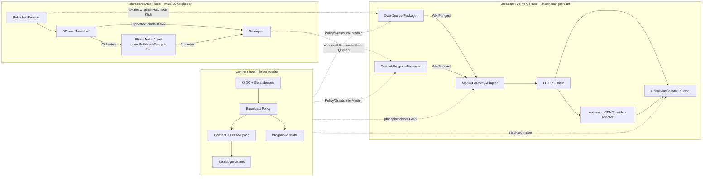

# ADR 0001: Interaktive, Broadcast- und Delivery-Planes trennen

- Status: angenommen
- Datum: 2026-09-03
- Todo: `TBP-002`
- Ausgangsbasis: Git-Revision `191e4c9`

## Kontext

Der bestehende Raum ist eine interaktive WebRTC-Anwendung für höchstens 20
Mitglieder. Die Node-Control-Plane autorisiert Membership und Routing, während
Browser und freiwillige Blind-Media-Agenten die Medien transportieren. Im
Produktionsmodus schützt SFrame die Medienframes zusätzlich zu DTLS-SRTP. Der
Node-Server und Blind-Agenten besitzen keine SFrame-Schlüssel.

Eine Sendung an ein größeres, überwiegend passives Publikum hat andere
Eigenschaften. Sie braucht einen bewusst erzeugten Program-Stream, Ingest,
mehrere Ausgabeformate, getrennte Zuschauerautorisierung und gegebenenfalls
CDN-Verteilung. Sie darf weder die 20er-Grenze umgehen noch den existierenden
Raum, dessen E2EE-Aussage oder einen blinden Agenten still umdeuten.

Diese ADR entscheidet die Komponenten- und Vertrauensgrenzen. Sie führt noch
keinen produktiven Broadcastpfad ein. Contracts, konkrete Adapter und
Deployments folgen in eigenen Tasks.

## Entscheidung

Das System besteht aus drei strikt getrennten Planes:

1. Die **Control Plane** besitzt Identität, Policy, Consent, Leases, Grants und
   Zustandsübergänge. Sie verarbeitet keine Medien- oder Untertitelinhalte.
2. Die **Interactive Data Plane** bleibt der vorhandene SFrame-geschützte
   WebRTC-Raum mit höchstens 20 Mitgliedern, direkten Pfaden, TURN und optional
   consentierten Blind-Agenten.
3. Die **Broadcast Delivery Plane** beginnt ausschließlich nach einer
   sichtbaren lokalen Freigabe an einem Own-Source- oder Trusted-Program-
   Packager. Sie führt über einen Gateway-Adapter zu LL-HLS und später nur nach
   Capability-Gate zu weiteren Ausgaben wie MoQ oder WHEP.

Ein Broadcast-Zuschauer ist kein Raumteilnehmer. Ein Trusted-Packager ist kein
Blind-Agent. Diese Rollen sind in Prozessidentität, Contracts, Schlüsseln,
Capabilities und Bedienoberfläche disjunkt.

## Komponenten und kleine Software-Ports

„Port“ bezeichnet in diesem Abschnitt eine kleine, austauschbare
Softwareschnittstelle im Sinne von Ports and Adapters, nicht automatisch einen
offenen TCP-/UDP-Port. Domaincode kennt nur versionierte DTOs und diese Ports,
keine MediaMTX-, Cloudflare-, Player- oder Codec-SDK-Typen.

### 1. Control Plane

Verantwortung:

- OIDC-Tenant, Membership, Raumrolle und Gerätebeweis prüfen;
- quellen-, zweck-, epoch- und zeitgebundenen Consent verwalten;
- Admission-Control, Zustandsmaschine und genau einen aktiven Lease-Inhaber
  pro Program/Epoch durchsetzen;
- kurzlebige Publisher-, Packager- und Playback-Grants ausstellen;
- Provider-Secrets ausschließlich serverseitig halten;
- nur technische, inhaltsfreie Zustände und Metriken annehmen.

Verboten sind Empfang, Entschlüsselung, Mischung, Transcoding, Segmentierung,
Speicherung oder Logging von Medien-, Chat- und Untertitelinhalten.

Kleine Ports:

- `BroadcastPolicyPort`: beantwortet, ob eine konkrete Aktion für Principal,
  Raum, Rolle, Quelle und Program zulässig ist;
- `BroadcastConsentPort`: erzeugt, widerruft und prüft eng gebundene Consents;
- `ProgramLeasePort`: vergibt gefencte Leases und lehnt veraltete Epochen ab;
- `BroadcastGrantIssuerPort`: stellt kurzlebige, pfad- und aktionsgebundene
  Grants aus, niemals Provider-Langzeitsecrets;
- `BroadcastProgramStorePort`: persistiert ausschließlich erlaubte Metadaten
  und Zustandsübergänge;
- `BroadcastTelemetryPort`: akzeptiert begrenzte technische Messwerte ohne
  Inhalt, Token, Room-Code, SDP, ICE, IP-Kandidaten oder Captiontext.

### 2. Interactive SFrame Data Plane

Die vorhandenen Browserports für Capture, Publication, Subscription,
PeerConnection, SFrame und DataChannel bleiben Eigentümer des interaktiven
Raums. Broadcast verändert keine Membership-, Peer-, Topology- oder
SFrame-Contracts. Ein Raumpeer erhält durch Broadcast weder zusätzliche
Schlüssel noch Rechte.

Blind-Media-Agenten dürfen weiterhin nur:

- ICE/DTLS-SRTP-Endpunkte für autorisierte Routen bereitstellen;
- bereits SFrame-verschlüsselte RTP-Nutzlasten weiterleiten;
- begrenzte technische Health-/Lastdaten melden.

Ihre Capability-Schemas enthalten keinen Decrypt-, Mix-, Record-, Caption-
oder Broadcast-Packager-Port. Enrollment oder Raumconsent kann diese
Capabilities nicht nachträglich ergänzen. Ein Prozess, der entschlüsseln darf,
muss als separate Trusted-Packager-Identität und über separate Contracts
registriert werden.

### 3. Own-Source-Packager

Der Own-Source-Packager läuft zunächst im veröffentlichenden Browser und darf
nur lokal gestartete Originaltracks dieses Nutzers verarbeiten. Ein sichtbarer
Klick erzeugt vor der SFrame-Transformation einen getrennten Fork. Das Öffnen
eines Panels, Join, Playback oder ein Remotesignal darf weder Capture noch
Broadcast starten.

Kleine Ports:

- `LocalProgramSourcePort`: liefert ausschließlich bereits lokal und bewusst
  gestartete Track-Clones;
- `ProgramCompositionPort`: wählt Layout und Audioquellen für das lokale
  Program, ohne fremde Quellen zugänglich zu machen;
- `ProgramEncoderPort`: deklariert Codecs, Layer und Ressourcenlimits;
- `BroadcastIngestPort`: publiziert mit einem kurzlebigen Grant und besitzt
  idempotente Start-/Stop-/Abort-Lifecycles.

Stop, Leave, Logout, Lease-Verlust, Quellenende oder Seitenende stoppt Clones,
Encoder und Ingest idempotent. Der interaktive SFrame-Track läuft nur weiter,
wenn der Benutzer ihn nicht ebenfalls beendet hat.

### 4. Trusted-Program-Packager

Ein Trusted-Program-Packager ist ein bewusst gewählter Medienendpunkt für
fremde oder gemischte Quellen. Er kann als separater Browser- oder nativer
Prozess implementiert werden. Er erhält nur die explizit ausgewählten Quellen
und nur während eines gültigen, gefencten Program-Lease.

Kleine Ports:

- `AuthorizedProgramSourcePort`: öffnet nur eine Quelle, deren Publisher-
  Consent zu Raum, Publication, Zweck, Packager, Lease und Epoch passt;
- `SourceDecryptPort`: existiert ausschließlich im Trusted-Packager-Prozess
  und nimmt keine Blind-Agent-Identität an;
- `ProgramMixerPort`: mischt erlaubte Audiospuren und komponiert erlaubte
  Videospuren, ohne Chat oder Data-Overlay einzubeziehen;
- `ProgramEncoderPort` und `BroadcastIngestPort`: entsprechen den kleinen,
  adapterunabhängigen Verträgen des Own-Source-Pfads;
- `KeyLifecyclePort`: importiert nur kurzlebiges, quellbezogenes Material und
  entfernt es bei Widerruf, Epochwechsel, Stop oder Prozessende.

Quellenaufnahme und Entschlüsselung sind getrennte Autorisierungen. Ein
Program-Operator kann keine Quelle allein durch Layoutauswahl freischalten.

### 5. Media-Gateway

Das Gateway nimmt ausschließlich den absichtlich erzeugten Program-Stream an.
Es sieht keine nicht ausgewählten Raumquellen und besitzt keine SFrame-
Raumschlüssel. Seine erste Adapterimplementierung darf MediaMTX verwenden,
aber die Domain kennt MediaMTX nicht.

Kleine Ports:

- `GatewayCapabilityPort`: liefert versionierte, belegte Ingest-, Codec-,
  Output-, Auth-, Caption-, Recording- und Health-Capabilities;
- `GatewayPublicationPort`: provisioniert und beendet einen undurchsichtigen,
  zufälligen Ingestpfad mit kurzlebiger Berechtigung;
- `GatewayDeliveryPort`: beschreibt verfügbare LL-HLS-/HLS- und optional
  capability-gegatete MoQ-/WHEP-Endpunkte;
- `GatewayHealthPort`: liefert inhaltsfreie Readiness-, Kapazitäts- und
  Fehlerklassen;
- `GatewayAdminPort`: bleibt serverseitig und ist niemals direkt im Browser
  erreichbar.

Ein Adapter muss unbekannte Capability-Felder und nicht belegte Kombinationen
ablehnen. Remux, Transcode und Passthrough werden getrennt ausgewiesen.

### 6. CDN-/Provider-Adapter

Ein Provider erhält nur die freigegebene Broadcastausgabe. Er erhält keine
Raumschlüssel, Room-Codes, OIDC-Tokens der Teilnehmer oder Zugriff auf die
Interactive Plane.

Kleine Ports:

- `DeliveryProviderCapabilityPort`: benennt belegte Protokolle, Regionen,
  Auth, Retention, Kosten- und Größenlimits;
- `DeliveryPublishPort`: erstellt/entfernt einen Delivery-Endpunkt über
  serverseitige Credentials;
- `DeliveryAccessPort`: mintet kurze Playback-Autorisierung oder delegiert an
  einen autorisierenden Reverse-Proxy;
- `DeliveryTelemetryPort`: nimmt aggregierte technische Delivery-Metriken an.

Cloudflare Stream, Cloudflare MoQ, ein CDN oder ein eigener Origin sind
verschiedene Adapter und werden nicht aufgrund ihres Herstellernamens als
capability-gleich behandelt.

### 7. Viewer

Der Viewer besitzt nur einen Playback-Port:

- `PlaybackSessionPort`: löst für ein sichtbares Program einen öffentlichen
  oder kurzlebig autorisierten Delivery-Endpunkt auf;
- `PlaybackAdapterPort`: spielt eine belegte Ausgabe ab und fällt nach Policy
  von optionalem MoQ/WHEP auf LL-HLS/HLS zurück;
- `CaptionPlaybackPort`: rendert später nur explizit publizierte Captiontracks.

Ein Viewer:

- tritt keinem Raum bei und erhält keine Peer-ID;
- erscheint nicht in Membership, Peer-Liste, 20er-Grenze, Mesh- oder
  Relay-Topologie;
- erhält keine SFrame-Room-Schlüssel, SDP-/ICE-Signale, DataChannels oder
  interaktive Medienrechte;
- kann für private Wiedergabe OIDC oder einen Playback-Grant benötigen, ohne
  dadurch Raumteilnehmer zu werden;
- unterliegt eigenen Viewer-, Origin-, Egress- und Kostenlimits.

Viewer-Zahlen dürfen als aggregierte Delivery-Metrik erscheinen, verleihen
aber niemals Membership- oder Routing-Autorität.

## Wo Klartext existiert

Transportverschlüsselung schützt jeweils den Weg, ändert aber nicht, welcher
Endpunkt Medien verarbeiten kann. Der Broadcastzweig erbt nicht automatisch
die SFrame-E2EE-Eigenschaft des Raums.

| Quelle | Klartext vor dem Broadcast | SFrame-/Blind-Pfad | Klartext für Programbildung | Broadcastausgabe |
| --- | --- | --- | --- | --- |
| Nur lokale Quelle | Im Capture-Gerät und veröffentlichenden Browser; der Own-Source-Fork liegt bewusst vor SFrame | Der parallele Raumtrack bleibt SFrame-Ciphertext; Blind-Agenten sehen nur Ciphertext und Transportmetadaten | Nur im Own-Source-Packager desselben Nutzers | Gateway, optionaler Provider und Viewer können das absichtlich veröffentlichte Program gemäß ihrem Zweck verarbeiten |
| Fremde Quelle | Im Capture-Gerät und Browser des Quell-Publishers | Bis zum autorisierten Empfänger SFrame-Ciphertext; Direct, TURN und Blind-Agent bleiben blind | Erst im explizit consentierten Trusted-Program-Packager nach SFrame-Decrypt | Wie oben; nicht ausgewählte Quellen fehlen vollständig |
| Gemischtes Program | Jeweils lokal bei jedem Quell-Publisher | Jede fremde Quelle bleibt bis zum Trusted-Packager separat SFrame-geschützt | Im Trusted-Packager nur für die Menge gültiger, quellbezogener Consents; dort Mix/Komposition/Re-Encode | Nur der neu erzeugte Program-Stream, nicht die ursprünglichen Room-Schlüssel oder Einzelquellen |

Die Control Plane sieht in keinem Fall Klartext. Ein Media-Gateway oder Provider
sieht nur die bewusst für Zuschauer erzeugte Ausgabe. TLS, DTLS-SRTP,
Objektverschlüsselung, signierte URLs oder DRM dürfen für diesen Zweig nicht
als SFrame-Raum-E2EE bezeichnet werden.

## Autoritäts- und Lebenszyklusregeln

1. Ein Principal fordert eine konkrete Aktion für ein konkretes Program an.
2. Die Control Plane prüft Tenant, Membership beziehungsweise Viewerpolicy,
   Rolle, Quelle, Consent, Quote, Zieladapter und aktuelle Epoch.
3. Sie stellt einen minimalen, kurzlebigen Grant aus. Der Grant enthält keine
   Medien, Room-Schlüssel oder Provider-Langzeitsecrets.
4. Packager und Gateway müssen Program-, Pfad-, Aktion-, Lease- und Epoch-
   Bindung prüfen; unbekannte Felder und Capabilities scheitern fail-closed.
5. Widerruf, Lease-Verlust, Epochwechsel, Leave, Logout oder Quellenende
   beendet den betroffenen Pfad idempotent und entfernt erreichbares
   Schlüsselmaterial.
6. Playback bleibt eine getrennte Aktion. Publizieren berechtigt nicht
   automatisch zum administrativen Gatewayzugriff; Zuschauen berechtigt nicht
   zum Publizieren oder Raumbeitritt.

## Netzwerkgrenzen

Die Softwareports verlangen keine pauschale Portfreigabe. Das Deployment legt
pro aktivierter Capability minimale Netzgrenzen fest:

- Browserzugriff auf Control Plane, WHIP-Frontend und Playback ausschließlich
  über HTTPS/WSS am Reverse-Proxy;
- Gateway-Ingest entweder über einen eng begrenzten Reverse-Proxy-Pfad oder ein
  privates Netz, nie über seine Admin-API;
- Gateway-Control, Metriken und Provider-Credentials nur serverseitig in einem
  isolierten Netz;
- HLS-/LL-HLS-Ausgabe über HTTPS; CDN-Originzugriff optional zusätzlich durch
  mTLS, Allowlist oder signierten Originzugriff geschützt;
- UDP/QUIC nur für eine tatsächlich aktivierte und geprüfte MoQ-/HTTP3-
  Capability; kein offener Port allein aufgrund eines Plans;
- vorhandenes ICE/STUN/TURN bleibt ausschließlich der Interactive Plane
  zugeordnet, sofern ein Adapter nicht ausdrücklich etwas anderes deklariert.

Konkrete Host-, Port- und Firewallwerte sind Deploymentkonfiguration und
werden erst mit dem jeweiligen Adapter festgelegt. Admin- und Metrikports sind
nie öffentliche Browserports.

## Adapter- und Capability-Regeln

- Domain-DTOs verwenden eigene versionierte Begriffe wie Program, Source,
  Rendition, DeliveryEndpoint, Grant, Consent, Lease und Capability.
- Herstellerantworten werden an der Infrastrukturgrenze validiert und in diese
  DTOs übersetzt. Herstellerfelder gelangen nicht in zentrale Domain-
  Contracts oder Angular-Komponenten.
- Jede Capability benennt mindestens Version, Richtung, Protokoll, Codec,
  Auth-Modell, Stabilitätsgrad und belegten Teststand.
- Abwesend, unbekannt oder veraltet bedeutet nicht verfügbar. Experimentelle
  Capabilities sind standardmäßig aus und besitzen einen dokumentierten
  Fallback.
- UI und Orchestrierung fragen Capability-Ports ab; sie verzweigen nicht auf
  Herstellernamen.
- Austausch eines Gateways, Players oder Providers verändert Adapter und
  Deployment, nicht Membership, SFrame, Consent- oder Program-Domainregeln.

## Verworfene Alternativen

### Medien im vorhandenen Node-Server terminieren

Verworfen, weil dies die kleine Control Plane mit Medieninhalt, Codecs,
Ressourcenlast und zusätzlichen Secrets koppeln sowie die bestehende
Sicherheitsgrenze brechen würde.

### Blind-Agenten per Konfiguration zu Packagern machen

Verworfen, weil ein optionales Decrypt-Flag die prüfbare Blindheit zerstören
würde. Trusted-Packager brauchen eine eigene Prozessrolle, Identität,
Capability und Zustimmung.

### Zuschauer als zusätzliche WebRTC-Raumpeers aufnehmen

Verworfen, weil dies die 20er-Grenze, Membership-Autorität und Fanoutkosten
unterlaufen und passive Zuschauer mit interaktiven Rechten vermischen würde.

### MediaMTX- oder Providerobjekte als Domainmodell verwenden

Verworfen, weil dies Browser, Control Plane und Policy an einen Hersteller und
dessen momentane Beta-/API-Eigenschaften koppeln würde.

### Broadcast automatisch beim Raumbeitritt starten

Verworfen. Capture und Veröffentlichung benötigen jeweils sichtbare lokale
Benutzerhandlungen und getrennte, widerrufbare Freigaben.

## Folgen

Positiv:

- bestehende Membership-, SFrame- und Blind-Agent-Garantien bleiben
  überprüfbar;
- Zuschauerzahl und Delivery-Skalierung sind vom interaktiven Mesh entkoppelt;
- Own-Source kann klein beginnen, ohne fremde Entschlüsselungsrechte;
- Gateways, Player und Provider bleiben austauschbar;
- Security Claims können pro Plane präzise und ehrlich sein.

Kosten und Einschränkungen:

- Trusted-Program-Broadcast benötigt explizites Vertrauen, Consent- und
  Schlüssellebenszyklus sowie zusätzliche Ressourcen;
- Broadcastausgabe ist ohne einen späteren separaten Secure-Objects-Pfad nicht
  SFrame-Raum-E2EE;
- mehrere Zustandsmaschinen, Grants, Adapter und Failure-Gates erhöhen den
  Implementierungs- und Betriebsaufwand;
- LL-HLS, MoQ, WHEP, Codec-/Transcodepfade und Provider werden erst nach
  jeweils eigener Capability- und Browserprüfung freigegeben.

## Prüfkriterien dieser Entscheidung

- Jede der sieben Komponenten besitzt eine abgegrenzte Verantwortung und
  kleine Ports.
- Die Klartextmatrix unterscheidet lokale, fremde und gemischte Quellen.
- Blind-Agenten besitzen weder Schlüssel noch Decrypt-/Packager-Capability.
- Viewer sind vollständig außerhalb von Membership, Peer-Liste, 20er-Grenze
  und Mesh.
- Domain und Angular-UI hängen nicht von einem Gateway-, Player- oder
  Providerhersteller ab.

Das folgende Threat Model (`TBP-003`) konkretisiert Angreifer, Retention,
Missbrauchsfälle und testbare Mitigations. Die Capability-Matrix (`TBP-004`)
entscheidet anschließend anhand versionierter Primärquellen, welche Adapter
und Browserpfade tatsächlich aktiviert werden dürfen.
