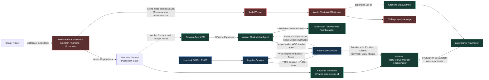
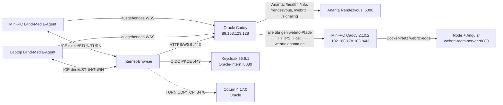

# Broadcast-Ausgangsbasis vor dem ersten Packager

Stand: 2026-09-03. Diese Inventur ist der verifizierte Nullpunkt von
`TBP-001`. Ausgangsrevision ist `5977482`; die Aufnahme wurde gegen den
laufenden öffentlichen Dienst, den Mini-PC, den Oracle-Host sowie einen realen
lokalen Zwei-Browser-Test geprüft. Sie beschreibt ausschließlich vorhandene
Pfade. MediaMTX, WHIP, LL-HLS, MoQ, ein Trusted-Program-Packager und ein
Zuschauer-Player sind zu diesem Zeitpunkt **nicht implementiert und nicht
deployed**.

Die ausführlichen Direct-, TURN-, Browser-Relay-, Single-/Multi-Agent- und
Bandbreitendiagramme bleiben in
[current-architecture-uml.md](current-architecture-uml.md) kanonisch. Dieses
Dokument ergänzt die für den Broadcast-Ausbau notwendige Trust-, Port-,
Capability-, Ressourcen- und Verifikationsmatrix.

## Implementierter Ist-Datenfluss



Klartextmedien existieren im normalen Pfad nur im capture-besitzenden Browser
vor der SFrame-Transformation und nach der SFrame-Entschlüsselung beim
autorisierten Empfänger. Vosk verarbeitet einen Clone eines bereits lokal
gestarteten Audiotracks. Weder der Node-Server noch TURN noch der
Blind-Media-Agent erhalten SFrame-Schlüssel. Caption-Text ist nicht SFrame-
verschlüsselt: Bei aktiviertem Raumteilen sehen die Zielbrowser ihn innerhalb
des DTLS/SCTP-geschützten direkten DataChannels im Klartext.

## Beobachtetes Deployment



Am Aufnahmetag lösten `webrtc.ananta.de` und `keycloak.ananta.de` öffentlich
auf `89.168.123.128` auf. Der Oracle-Caddy bedient Keycloak direkt. Für
`webrtc.ananta.de` behält er Anantas oben genannte Rendezvous-Pfade beim
Python-Dienst und proxyt alle anderen Pfade über HTTPS zum vorhandenen
Mini-PC-Caddy. Dieser leitet über den Alias `webrtc-room-server` an den
eigenständigen Node-/Angular-Container weiter. Damit bleibt der ursprüngliche
Ananta-Pfad erhalten, ist aber keine Runtime-Abhängigkeit dieser Anwendung.

Der öffentliche Healthcheck antwortete mit `status=ok`; ausgeliefert wurde
`main-WB4CQHHM.js`. WebRTC-Container, Mini-PC-Caddy sowie die freiwilligen
Laptop- und Mini-PC-Media-Agent-Dienste waren aktiv und hatten jeweils null
beobachtete Neustarts. Diese Zustandsaufnahme ist keine Verfügbarkeits- oder
Kapazitätsgarantie.

## Komponenten- und Trust-Inventar

| Komponente oder Pfad | Besitzer / Autorität | Klartext- oder Schlüsselzugriff | Protokoll und Ports | Ressourcenwirkung | Verifizierter Stand und Lücke |
|---|---|---|---|---|---|
| Angular UI und Capture | lokaler Browser; nur sichtbare Nutzeraktion | eigener Medienklartext und nicht exportierbarer P-256-Geräteschlüssel | Secure Context; `getUserMedia`, `getDisplayMedia` | Geräte-Capture, Encoder, Akku und Upload | Chromium 151: Kamera, Mikrofon, Bildschirm, Stop und Leave real bestanden. Safari, iOS und Android hierfür noch unverified. |
| Node-Control-Plane | Server ist alleinige Membership-/Policy-Autorität | OIDC-Claims, Gerätebeweis, flüchtige Membership, SDP/ICE; keine Medien-, Chat- oder Caption-Inhalte | öffentlich HTTPS/WSS 443; intern HTTP 8080; `/signal`, `/media-agent` | JSON-/WS-State je Raum/Peer; keine Mediencodierung | 20er-Raumgrenze und geschlossene/ratenbegrenzte Contracts getestet. Container besitzt aktuell kein dokumentiertes Produktions-CPU-/RAM-Limit. |
| Keycloak | Identity Provider auf Oracle | Identität und OIDC-Token; keine Raummedien | HTTPS 443 außen, HTTP 8080 nur im Compose-Netz | Auth-/DB-Last | Discovery und required-Runtime-Konfiguration erreichbar; HA/Backup ist nicht Teil dieses Repositories. |
| Direct-SFrame-Mesh | Browser je Gegenüber | Endbrowser besitzen ihre autorisierten Publication-Keys; Zwischenpfade nicht | WebRTC ICE, DTLS-SRTP und SCTP; dynamische ICE-Pfade | bis zu `N-1`, bei 20 also 19 PeerConnections und Senderziele je Browser | Chromium 151 und Firefox 153 automatisiert; VP8 über SFrame-Counter 350 verifiziert. Keine garantierte 20er-QoS. |
| Infrastruktur-TURN | Coturn auf Oracle | DTLS-SRTP-/SFrame-Inhalt bleibt verschlüsselt; sichtbar sind Netzmetadaten | UDP/TCP 3478, TCP/TLS 5349 und UDP-Relaybereich 49160–49200 sind aktiv | zusätzliche Relay-Bandbreite pro PeerConnection | Kurzlebige REST-Credentials und reale All-TURN-Agentmatrix bestanden. Am 2026-09-05 wurden Zertifikatskette, TLS 1.3 und eine externe REST-authentisierte TURN/TLS-Doppelallokation mit null Paketverlust geprüft. Aktuelle kleine Oracle-Quoten sind weiterhin kein 20er-Kapazitätsnachweis. |
| freiwilliger Edge-TURN-Tier | operator-/nutzerkonfigurierter TURN-Agent | keine SFrame-Schlüssel oder Membership-Autorität | aus Runtime-ICE-Konfiguration; eigener Dienst typischerweise 3478 plus begrenzter UDP-Relaybereich | verschiebt Pakete, reduziert aber keinen Fanout | Öffentliche Runtime meldet den Tier als konfiguriert. Ein aktuell erreichbarer konkreter Edge-TURN-Endpunkt wird in dieser Inventur nicht behauptet. |
| Legacy Trusted Browser Relay | Control Plane autorisiert Kanten; Nutzerconsent bleibt nötig | Relay-Browser decodiert und re-encodiert fremde Videoframes | normale Browser-WebRTC-Pfade | Upload/CPU/Akku beim Relay; nur Videobaum | Implementiert und getestet, aber bei produktivem `MEDIA_E2EE_MODE=required` deaktiviert. Nicht blind und kein Broadcast-Packager. |
| nativer Blind-Media-Agent | Control Plane autorisiert nur kurze, raumgebundene Leases; Owner stimmt zu | terminiert ICE/DTLS-SRTP und sieht RTP-/Netzmetadaten, aber nur SFrame-Ciphertext und keinen Schlüssel | ausgehendes WSS 443 zur Control Plane; Browser-/Agent-WebRTC per ICE | Publisher sendet nach Readiness eine Simulcast-Publikation; Agent übernimmt selektiven Egress-Upload | Zwei aktive Linux-Agenten sowie Direct-/All-TURN-, Drain-, Partition-, Failover- und Single-Layer-Gates bestanden. macOS/Windows unverified; keine garantierte 20er-QoS. |
| Vosk-Caption-Pipeline | Browser des Sprechers | lokaler Audio-Klartext und erkannter Text; Zielbrowser sehen freigegebenen Text | lokaler AudioWorklet/WASM; optional geordneter SCTP-DataChannel | 4,3-MB-Worker plus ein Modell von etwa 32 bis 49 MB; RAM/CPU können deutlich höher sein | Chromium und Firefox prüfen Katalog, explizites Laden und Capture-Freiheit. Erkennungsqualität, mobile Last und zwei reale Sprachen bleiben vor Broadcast-Captions offen. |
| ECDH-/AES-GCM-Data-Overlay | Zielbrowser; Routen nur durch Control Plane | Zwischenpeers sehen opaque Pakete; private P-256-Schlüssel bleiben im Browser | SCTP-DataChannels; 12-KiB-Chunks, höchstens 96 Chunks, TTL höchstens 60 s, Pfad höchstens 5 Peers | begrenzte Browserqueues und zusätzlicher Peer-Upload | Replay-, TTL-, Hop-, Queue- und Resume-Grenzen getestet. Signaling bleibt für die Peer-Key-Zuordnung vertrauenswürdig. |
| Caddy-Kette | Oracle- und Mini-PC-Operator | TLS endet an beiden Proxies; kein Medienframe wird dort als Anwendungsklartext verarbeitet | 80 Redirect, 443 HTTPS/WSS; Oracle zu Mini-PC ebenfalls HTTPS | Proxy-Verbindungen und TLS | Doppelter Proxy, WebSocket und öffentlicher Healthpfad real beobachtet. Mini-PC veröffentlicht Node 8080 derzeit zusätzlich auf allen Hostinterfaces; Härtung ist ein Deployment-Backlogpunkt. |

## Aktuelle Runtime-Policy

Die öffentliche `/config`-Antwort wurde ohne Secrets aufgenommen:

- Authentisierung ist `required`; Issuer ist der Realm `ananta`, Client
  `webrtc-browser`, Audience `webrtc-room-server`.
- Medien-E2EE ist `required` mit `AES_128_GCM_SHA256_128` und
  `codec-prefix-v1`.
- Die Room-Grenze ist 20; Active-Speaker-Limit ist 5.
- Blind-Media-Agenten sind konfiguriert, Self-Service ist aktiv, Leases laufen
  30 Sekunden, bis zu zwei Standbys sind erlaubt, ein Agent darf ab drei
  Teilnehmern gewählt werden und Publisher-Sharding beginnt ab sechs.
- Der aktuell ausgerollte Legacy-Browser-Relay-Schwellwert ist sechs, obwohl
  der Quellcode einen niedrigeren Default unterstützt. Im required-SFrame-
  Modus bleibt dieser entschlüsselnde Pfad unabhängig davon deaktiviert.
- TURN und ein Edge-Relay-Tier werden als konfiguriert gemeldet. Kurzlebige
  Credentials erscheinen erst in der autorisierten Session-Antwort; diese
  Inventur gibt weder Credentials noch interne ICE-Details wieder.

## Reale Zwei-Browser-Baseline

Der bestehende Playwright-Gate wurde für `TBP-001` um explizite
Ressourcen-Cleanup-Assertions erweitert. Mit zwei separaten Chromium-Seiten
prüft er:

1. Einstellungen, Raumbeitritt und Empfangsprofil lösen keinen Capture-Aufruf
   aus.
2. Erst die drei sichtbaren Buttons starten Kamera, Mikrofon und Bildschirm.
3. Beide Browser handeln `required` SFrame aus; der Empfänger rendert Kamera,
   Mikrofon und Bildschirm, während der DataChannel Chat überträgt.
4. Der Kameradecoder erhält über das Kontinuitätsfenster weiterhin neue
   gerenderte Frames; reine Bytezähler reichen nicht als Freeze-Beleg.
5. Der Bildschirm-Stopp setzt den Bildschirmtrack auf `ended`.
6. Leave stoppt auch Kamera und Mikrofon, alle beobachteten lokalen Tracks sind
   `ended`, der Gegenbrowser entfernt die Remote-Medien und sieht nur noch ein
   Raummitglied.

Ausgeführt wurde:

```bash
node --test \
  --test-name-pattern='two Chromium pages negotiate SFrame chat and media then clean every capture on stop and leave' \
  test/browser.e2e.test.js
```

Ergebnis: ein Test bestanden, kein Skip, Laufzeit rund 20 Sekunden, Chromium
151.0.7922.34. Der anschließende vollständige Projektgate bestand am
2026-09-03 mit 172 Angular-Tests, dem Produktions-Build und 99 Node-, Browser-
und Integrationstests. Darin bestanden auch der reale Firefox-Direktmeshpfad
und der codec-bewusste VP8-SFrame-Langzeittest über Counter 350: Ein durch das
Empfangsprofil bestätigtes Sender-Pause/Resume im selben Publication- und
SFrame-Kontext führte wieder zu einem decodierten Keyframe und fortlaufenden
Frames. Der optionale Live-Keycloak-/TURN-Gate blieb ohne bewusst gesetzte
Testzugangsdaten sichtbar übersprungen.

## Herkunft aus Ananta

[ananta-webrtc-adoption.md](ananta-webrtc-adoption.md) wurde erneut gegen das
lokale Ananta-Repository auf Revision `280279fd7` geprüft. Alle dort genannten
Quelldateien und die fünf commitgenau referenzierten Historienstände waren
vorhanden. Im produktiven Source-/Package-Graph dieses Projekts existiert
keine Ananta-Runtime-Abhängigkeit: Ananta liefert Ideen und Auditkontext,
während Node-, Angular-, Go-, Contract- und Deploymentcode eigenständig sind.

## Nullzustand des Broadcast-Zweigs

Der Source-, Paket-, Container- und Hostabgleich fand keine MediaMTX-, WHIP-,
HLS-/LL-HLS-, MoQ- oder Broadcast-Player-Implementierung. Es existieren daher
noch keine Broadcast-Grants, kein Viewer-Directory, kein Program-State, keine
Transcoding-/ABR-Pipeline, keine Broadcast-Caption-Ausgabe und keine
entsprechenden Ports. Die spätere Einführung muss additiv erfolgen:

- Room-Membership und ihre 20er-Grenze bleiben unverändert.
- Ein Blind-Media-Agent darf nicht zum Trusted-Packager umkonfiguriert werden.
- Own-Source darf nur nach einem neuen sichtbaren lokalen Start-Consent vor
  SFrame abgezweigt werden.
- Fremde Quellen benötigen einen getrennten, quellen- und packagergebundenen
  Decrypt-Consent.
- LL-HLS-/Gateway-Ausgabe besitzt nicht automatisch die E2EE-Eigenschaft des
  interaktiven Raums.

Diese Grenzen sind der Eingang für `TBP-002` bis `TBP-004`; sie aktivieren noch
keinen Medien-, Port- oder Zuschauerpfad.
