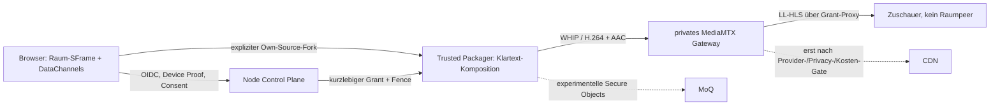
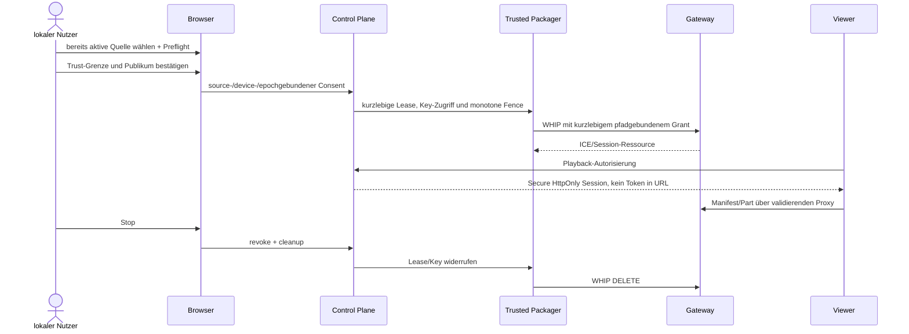
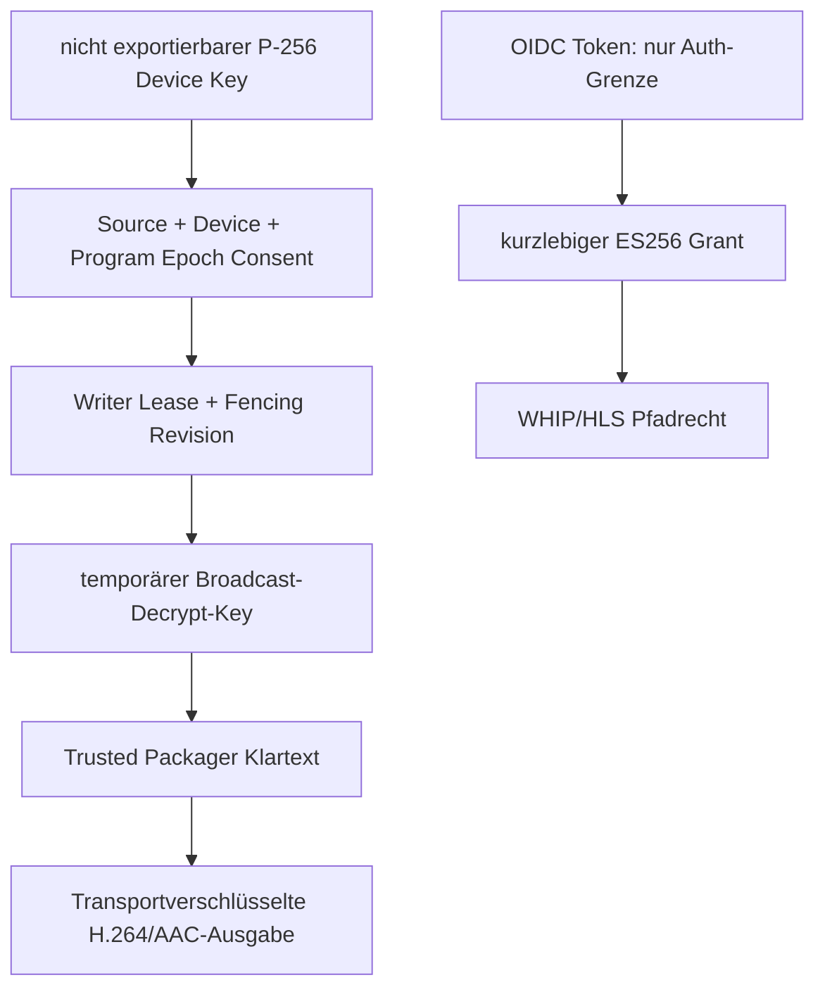
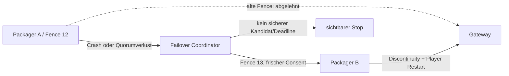

# Verifizierte Broadcast-Produktionsarchitektur und Freigabestatus

Stand: 2026-09-04. Durchgezogene Kanten sind implementiert oder lokal real geprüft; gestrichelte Kanten sind geplant beziehungsweise produktiv deaktiviert. Der aktuell aktive öffentliche Dienst ist ausschließlich das interaktive Meet.

Die Portgrenze bleibt Default-Deny: öffentlich sind nur Caddy 443 und ausdrücklich aktiviertes TURN; Node 8080, Gateway-API/-Metrics, WHIP-Origin, HLS-Origin und Packager-Steuerung bleiben privat. Der Codecpfad ist lokal als VP8-WHIP-Eingang und native H.264/AAC-Dreifachrendition geprüft. MediaMTX liefert LL-HLS; der Player wählt natives HLS oder hls.js. Captions werden lokal erzeugt und nur nach gesonderter Freigabe in das Programm übernommen. Recording und Transcript-Retention sind nicht implementiert.

Details: Architektur/Trust in `docs/adr/0001-separated-interactive-broadcast-delivery-planes.md`, Ports in `infra/deployment/port-firewall-matrix.v1.json`, Codecs in `docs/broadcast-codec-admission.md`, Player in `docs/broadcast-player.md`, Captions in `docs/broadcast-live-captions.md`, Failover in `docs/broadcast-failover-and-disaster-recovery.md`, Datenschutz in `infra/security/broadcast-review.v1.json` und Rollout in `infra/deployment/broadcast-rollout.v1.json`.
