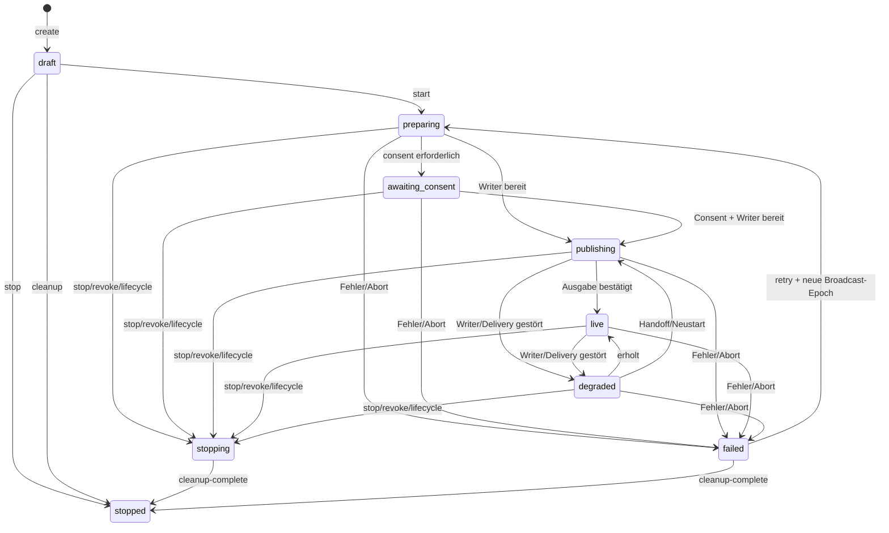

# Broadcast-State-Machine und Writer-Fencing

Stand: 2026-09-03. Dieses Dokument beschreibt den reinen Domain-Kern aus
`TBP-006`. Der Kern ist noch an keinen HTTP-/WebSocket-Endpunkt, Store,
Packager oder Media-Gateway angebunden und aktiviert daher keinen Medienpfad.

## Zustände

`stopped` ist terminal. `retry` ist ausschließlich aus `failed` erlaubt und
rollt sowohl Broadcast- als auch Lease-Epoch vor. Eine Quellenänderung rollt
dieselben beiden Epochen vor, leert alle Writer-Leases und führt ein bereits
gestartetes Programm nach `preparing` zurück. Eine identische Quellenliste ist
ein erfolgreicher No-op und erzeugt keinen zweiten Start.

## Reine Ports

- [`broadcast-program-model.js`](../src/broadcast-program-model.js) validiert
  und friert Snapshot, Scope, fünf getrennte Epochen, höchstens zwei
  rollengebundene Writer-Leases und das begrenzte Idempotenz-Ledger ein.
- [`broadcast-program-command.js`](../src/broadcast-program-command.js)
  akzeptiert nur geschlossene 16-KiB-Kommandos und bildet einen kanonischen
  SHA-256-Fingerprint. Im Domain-State liegt ausschließlich der Hash des
  Idempotency-Keys, nie der Key selbst.
- [`broadcast-program-machine.js`](../src/broadcast-program-machine.js) ist
  ein unveränderlicher Reducer: Snapshot + Kommando + injizierte Zeit ergeben
  den nächsten Snapshot und begrenzte Control-Plane-Effekte.
- [`broadcast-writer-fencing.js`](../src/broadcast-writer-fencing.js) prüft
  geschlossene Packager-/Gateway-Kommandos gegen die aktuelle Program-Revision,
  Broadcast-Epoch, Lease-Epoch und das exakt aktive, noch nicht abgelaufene
  rollenbezogene Fencing-Token.

Der Adapter, der den Snapshot später speichert, muss die erwartete
`program.revision` atomar per Compare-and-Set schreiben. Der Reducer nimmt
keine versteckte globale Registry an und bleibt dadurch für In-Memory-,
SQLite- oder externe Stores austauschbar.

## Idempotenz und Reihenfolge

Alle Domain-Kommandos tragen `idempotencyKeyHash`. Besonders die geforderten
Operationen `create`, `start`, `source-change`, `handoff`, `revoke`, `stop` und
`retry` werden im Snapshot erfasst.

- Gleiches Key-Hash plus gleicher kanonischer Kommando-Fingerprint liefert
  `duplicate: true` und eine leere Effektliste.
- Wiederverwendung desselben Key-Hash für andere Parameter wird abgewiesen.
- Ein neuer Key mit alter Program-Revision oder Broadcast-Epoch wird
  abgewiesen. Ein umgeordneter Lifecycle-Schritt wird von der Transition-Tabelle
  abgewiesen.
- Wiederholte Zustandsbestätigungen und identische Quellenlisten sind No-ops;
  sie starten keine zweite Publikation.
- Das Ledger ist auf 256 Einträge begrenzt. Bei Erreichen der Grenze wird die
  nächste Mutation abgewiesen, statt alte Replay-Belege still zu vergessen.

## Getrennte Epochen

| Epoch | Besitzer | Darf durch Broadcast-Kommandos verändert werden |
| --- | --- | --- |
| `membership` | Room-Membership | nein |
| `route` | Peer-/Agent-Routing | nein |
| `topology` | autorisierte Mesh-/DAG-Topologie | nein |
| `broadcast` | Program-Generation | nur `source-change` und `retry` |
| `lease` | Writer-Fencing | Handoff, Verlust, Cleanup und Epoch-Rollover |

`synchronizeBroadcastRoomEpochs()` übernimmt ausschließlich monotone
Membership-, Route- und Topology-Werte. Sie werden weder gleichgesetzt noch
aus der Broadcast-Epoch abgeleitet.

Für jede Program-Epoch existiert höchstens ein aktiver `packager-writer` und
ein aktiver `gateway-writer`. Ein Handoff benötigt die aktuelle Program-
Revision und Lease-Epoch; sein `fencingRevision` muss exakt der nächste Wert
sein. Ein zweiter Konkurrent mit demselben Ausgangssnapshot ist anschließend
stale. Alte Lease-Lost-Events können einen bereits eingesetzten Nachfolger
nicht entfernen.

## Cleanup und Recovery

| Auslöser | Deterministischer Übergang | Control-Plane-Effekte |
| --- | --- | --- |
| Leave, Logout, Room-Ende | aktiver Zustand → `stopping` | Grants widerrufen, Delivery stoppen, Quellen bereinigen |
| Consent-Widerruf, Source-Ende | aktiver Zustand → `stopping` | wie oben; Source-Referenz wird gegebenenfalls entfernt |
| Lease-Verlust | `publishing/live` → `degraded` | alten Writer fencen, Handoff anfordern |
| Prozessabbruch | aktiver Zustand → `failed` | Writer fencen, Grants widerrufen, Quellen bereinigen |
| `retry` | `failed` → `preparing` | alte Generation fencen/bereinigen, neue Generation vorbereiten |
| `cleanup-complete` | `stopping/failed` → `stopped` | Leases leeren und Lease-Epoch vorrollen |

Die Effektobjekte enthalten nur Scope, Revisionen, Epochen, Rollen, opaque
Referenzen und geschlossene Reason-Codes. Sie enthalten weder Medien, Caption-
Text, SDP/ICE, Tokens noch Secrets. Die spätere Outbox-/Adapterintegration muss
dieselben Idempotenz- und Fencing-Werte erhalten und darf sie nicht durch
Provider-Langzeitcredentials ersetzen.

## Nachweis

[`broadcast-program-machine.test.js`](../test/broadcast-program-machine.test.js)
läuft ausschließlich gegen den Domain-Kern. Der Test traversiert jeden Zustand,
wiederholt Kommandos, ordnet Ereignisse um, trennt alle fünf Epochen, prüft
abgelaufene beziehungsweise falsche Writer-Fences und simuliert zwei
konkurrierende Handoffs aus demselben Snapshot. Nach dem ersten akzeptierten
Handoff wird der zweite wegen der alten Revision abgewiesen; der Snapshot kann
zu keiner Zeit zwei aktive Writer derselben Rolle enthalten.
