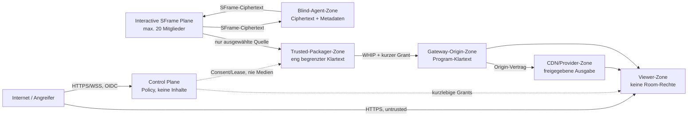

# Threat Model, Datenschutz und Security Claims für Broadcast

- Stand: 2026-09-03
- Geltungsbereich: Trusted-Broadcast-Packager-Track, `TBP-003`
- Architekturentscheidung: [ADR 0001](adr/0001-separated-interactive-broadcast-delivery-planes.md)

## Status und Zweck

Dieses Dokument ist der verbindliche Sicherheitsvertrag für den geplanten
Broadcastzweig. Es beschreibt Zielkontrollen und Testpflichten; es behauptet
nicht, dass der Broadcastpfad bereits implementiert oder produktionsreif ist.
Die bestehende, verifizierte Runtime ist in
[broadcast-baseline-inventory.md](broadcast-baseline-inventory.md)
dokumentiert.

Das Modell schützt zuerst die bestehende Eigenschaft des Produkts: Ein
interaktiver Raum bleibt auf höchstens 20 Mitglieder begrenzt, Medien bleiben
im required-Modus SFrame-geschützt und Blind-Agenten besitzen keinen
Decrypt-Port. Broadcast ist ein zusätzlicher, bewusst vertrauenswürdiger Pfad
für ausgewählte Quellen und Zuschauer außerhalb des Raums.

Die Regeln folgen Default Deny, Least Privilege, vollständiger
Objektautorisierung und Datenminimierung. Die hier genannten Fristen sind
technische Standardobergrenzen, keine Rechtsberatung. Vor öffentlicher
Freigabe muss der verantwortliche Betreiber Zweck, Rechtsgrundlage,
Auftragsverarbeitung, Region und gegebenenfalls kürzere Fristen prüfen.

## Normative Grundlage

- [RFC 9605](https://www.rfc-editor.org/rfc/rfc9605.html) definiert SFrame als
  zusätzliche E2EE-Schicht über einem hop-by-hop-geschützten Transport. KID,
  Counter und Verkehrsmetadaten sind nicht vollständig verborgen; Replay-
  Schutz und sichere Schlüsselzuordnung bleiben Anwendungsverantwortung.
- [RFC 9725](https://www.rfc-editor.org/rfc/rfc9725.html) verlangt für WHIP
  HTTPS und interoperable HTTP-Authentisierung. Seine Security Considerations
  nennen POST-/PATCH-Flooding, Ressourcenerschöpfung und erratbare Session-
  URLs ausdrücklich als Risiken.
- Die
  [OWASP Authorization Guidance](https://cheatsheetseries.owasp.org/cheatsheets/Authorization_Cheat_Sheet.html)
  fordert Default Deny und eine Prüfung der Berechtigung bei jeder Anfrage.
- Die
  [OWASP Logging Guidance](https://cheatsheetseries.owasp.org/cheatsheets/Logging_Cheat_Sheet.html)
  begründet strukturierte Security Events, warnt aber vor Tokens, Session-
  IDs, Schlüsseln und unnötigen personenbezogenen Daten in Logs.

Projektregeln und geschlossene Contracts sind strenger, wo die Quellen einen
Implementierungsspielraum lassen.

## Schutzziele

Priorität in absteigender Reihenfolge:

1. Keine Broadcaständerung schwächt Membership, SFrame, Gerätebindung oder
   Blindheit des interaktiven Raums.
2. Nur sichtbar ausgewählte, aktuell consentierte Quellen erreichen genau den
   autorisierten Packager und das autorisierte Program.
3. Capture, Decrypt, Mix, Publish, Playback, Record und Caption-Publish sind
   getrennte Aktionen; eine Berechtigung impliziert keine andere.
4. Widerruf und Stop wirken innerhalb eines definierten Budgets, verhindern
   neue Ausgabe und entfernen erreichbares Schlüsselmaterial.
5. Private Programs und Segmente sind nicht durch Namen, IDs, Pfade, Referer
   oder Viewerzählung enumerierbar.
6. Broadcastüberlast, Providerfehler und Angriffe beeinträchtigen weder
   Signaling noch den interaktiven Medienpfad oder TURN-Credential-Ausgabe.
7. Logs und Metriken bleiben inhaltsfrei, pseudonym und cardinality-begrenzt.
8. Unbekannte Typen, Felder, Zustände, Capabilities und Versionen scheitern
   fail-closed.

## Assets

| Asset | Vertraulichkeit | Integrität | Verfügbarkeit |
| --- | --- | --- | --- |
| SFrame-Room-Schlüssel und Quellschlüssel | kritisch; nur berechtigte Browser und gegebenenfalls der eng gebundene Trusted-Packager | falsche Zuordnung kann fremde Quelle öffnen oder Frames fälschen | Verlust darf Quelle stoppen, nicht auf Klartext-Fallback schalten |
| Lokale, fremde und gemischte Medienquellen | kritisch bis zur bewussten Veröffentlichung; öffentliche Programausgabe ist absichtlich öffentlich | Quellenauswahl, Reihenfolge und Inhalt dürfen nicht unautorisiert verändert werden | begrenzte Degradation zulässig, stilles Weiterpublizieren nicht |
| Captiontext und Sprecherzuordnung | Inhalt; gleiches Schutzprofil wie die zugehörige Quelle/Programausgabe | Zeitbasis, Sprache und Widerruf müssen stimmen | Captionausfall darf Medien nicht unkontrolliert stoppen |
| OIDC-, Device-, Publisher-, Packager- und Playback-Grants | kritisch und kurzlebig | exakte Issuer-/Audience-/Subject-/Tenant-/Action-/Path-/Epoch-Bindung | Ausfall führt zu kontrollierter Ablehnung |
| Consent, Lease, Epoch und Program-State | vertrauliche Metadaten | kritisch gegen Replay, Split-Brain und ungewollte Veröffentlichung | muss idempotent wiederherstellbar sein, ohne Medien/Keys zu persistieren |
| Gateway-/Provider-Secrets | kritisch; ausschließlich serverseitig | Rotation und Rollentrennung | Ausfall isoliert Broadcast, nicht das Meet |
| Identität, Rollen und Ownership | personenbezogen | keine Cross-Tenant-/Cross-Room-Verwechslung | berechtigte Stop-/Revoke-Aktion muss verfügbar bleiben |
| Technische Metriken, IP-/Netz- und Nutzungsmetadaten | personenbeziehbar, obwohl kein Medieninhalt | Manipulation darf Routing/Abrechnung nicht still steuern | begrenzte Telemetrieausfälle dürfen keine Rechte erweitern |
| Origin-, CDN-, Encoder- und Egressressourcen | intern | Konfiguration und Limits geschützt | DoS-/Kostenverstärkung begrenzen |

## Akteure und Vertrauenszonen

### Vertrauenswürdige Rollen mit begrenzter Autorität

- **Control Plane:** Policy-Autorität ohne Medienzugriff.
- **Raummitglied:** darf nur eigene Captures starten und genau gewährte
  Raumaktionen ausführen.
- **Program-Operator:** darf nach Rolle ein Program konfigurieren, aber keine
  Quelle ohne deren separaten Consent entschlüsseln.
- **Own-Source-Packager:** darf nur lokale Originaltracks seines Principals
  vor SFrame forken.
- **Trusted-Program-Packager:** darf ausschließlich consentierte Quellen in
  gültigem Lease/Epoch entschlüsseln und neu codieren.
- **Media-Gateway:** darf den bewusst erzeugten Program-Stream ingestieren und
  ausliefern, besitzt aber keine Room-Schlüssel.
- **CDN/Provider:** erhält nur freigegebene Programausgabe und technische
  Delivery-Metadaten.
- **Viewer:** darf ausschließlich öffentliche oder separat autorisierte
  Playbackressourcen lesen.
- **Operator/Administrator:** verwaltet Infrastruktur, erhält dadurch aber
  keine legitime Erlaubnis, Raum- oder Captioninhalt aufzuzeichnen.

### Angreifer

- anonymer Internetclient oder View-Bot;
- authentifizierter, aber unberechtigter Nutzer aus demselben oder einem
  anderen Tenant/Raum;
- bösartiges Raummitglied oder Program-Operator;
- kompromittierter Browser, Packager, Blind-Agent, Gateway, Provideradapter,
  CDN-Account oder Operatorzugang;
- Netzwerkangreifer zwischen Planes;
- manipulierte Abhängigkeit, Containerimage, Player- oder Codecparser;
- interner Beobachter von Logs, Backups oder Metriken.

Kein „vertrauenswürdig“ bedeutet grenzenlos. Jeder Übergang wird anhand des
konkreten Objekts, der Aktion und der aktuellen Epoch erneut autorisiert.

## Ehrliche Security Claims

Die folgenden Bedeutungen müssen später in UI, Dokumentation, API und
Contracts konsistent erscheinen. Ein grünes Schloss allein genügt nicht.

| Claim | Was geschützt ist | Wer Klartext sehen kann | Was ausdrücklich nicht behauptet wird |
| --- | --- | --- | --- |
| **SFrame-Raum-E2EE** | Audio-/Video-/Bildschirmframes vom sendenden bis zu berechtigten Raumendpunkten; DTLS-SRTP schützt zusätzlich jeden Hop | Publisher- und Empfängerbrowser; bei explizitem Trusted-Program-Consent auch der konkrete Trusted-Packager für konkrete Quellen | keine vollständige Metadatenanonymität, keine Viewer-E2EE, kein Schutz vor kompromittierten berechtigten Endpunkten |
| **Blind weitergeleitet** | Media-Agent erhält SFrame-Ciphertext statt Medienklartext | berechtigte Raumendpunkte, nicht der Agent | IP, Timing, Codec, KID/Counter-Kontext und Datenrate sind nicht vollständig verborgen |
| **Trusted Program** | Zugriff wird durch Quelle, Packager, Program, Zweck, Lease und Epoch begrenzt | der konkrete Trusted-Packager sowie danach Gateway/Provider/Viewer gemäß Sichtbarkeit | nach Decrypt/Re-Encode keine fortbestehende SFrame-Raum-E2EE |
| **Own Source** | nur ein lokal gestarteter Originaltrack wird vor SFrame bewusst geforkt | lokaler Browser/Native-Packager und Broadcastkette | keine Berechtigung für fremde Quellen; Transportverschlüsselung ist keine E2EE-Garantie gegenüber Gateway/Provider |
| **Transportverschlüsselt** | HTTPS/TLS oder DTLS-SRTP schützt einen Netzwerkhop | beide Endpunkte dieses Hops | kein Schutz vor einem kompromittierten oder absichtlich klartextverarbeitenden Endpunkt |
| **Private Wiedergabe** | Zugriffskontrolle über kurze Playback-Berechtigung und geschützte Manifest-/Segmentpfade | berechtigter Viewer, Origin und gegebenenfalls Provider | kein DRM, kein Kopierschutz und keine E2EE; ein berechtigter Viewer kann Inhalt technisch erfassen |
| **Öffentliche Wiedergabe** | Transportintegrität/-vertraulichkeit auf dem Weg per HTTPS | jeder, der die Veröffentlichung aufrufen kann, plus Deliverykette | keinerlei Inhaltsvertraulichkeit oder kontrollierbare Weitergabe nach Empfang |
| **Objektverschlüsselt (optional/experimental)** | nur die konkret definierte Objekt-/Chunk-Nutzlast gegen Relays ohne Schlüssel | Endpunkte des separaten Objekt-Key-Modells | aktuell nicht implementiert; nicht automatisch identisch mit Room-SFrame, DRM oder anonymem Zugriff |
| **Aufzeichnung** | nur ein später ausdrücklich aktivierter, separat consentierter Recordingpfad | hängt vom künftigen Recordingvertrag ab | derzeit nicht vorhanden und nie impliziter Bestandteil von Live oder Captioning |

Caption-Sonderfall: Im heutigen Raum laufen geteilte Vosk-Ergebnisse über den
dedizierten WebRTC-DataChannel und werden nicht als SFrame-Medienclaim
bezeichnet. Im Broadcast sind finalisierte Captions Programinhalt und müssen
denselben Zugriffsschutz, Widerruf und Segmentlebenszyklus wie das Program
erhalten. Die Control Plane, Blind-Agenten, Logs und Metriken sehen keinen
Captiontext.

## Datenschutz- und Aufbewahrungsmodell

### Grundsätze

- Es wird nur erhoben, was für Autorisierung, Betriebssicherheit, Abrechnung
  oder sichtbare Produktfunktion erforderlich ist.
- Content und Control-Daten liegen in getrennten Systemen und Backups.
- Standardmäßig gibt es weder Recording, DVR, dauerhaftes Transcript noch
  personenbezogenes Viewerprofil.
- Fristen werden technisch als TTL/Purge-Job erzwungen und mit synthetischen
  Canaries getestet; eine Dokumentationsfrist ohne Löschpfad reicht nicht.
- Providerfristen dürfen nie still länger sein. Unbekannte oder nicht
  konfigurierbare Retention macht den Adapter für private Programs
  `unavailable`.
- Backups enthalten keine Medien, Keys, Tokens, Segmente oder Captiontexte.
  Metadatenlöschung muss auch Backup-Ablauf und Restore-Verhalten abdecken.

### Datenklassen

| Datenklasse | Zweck und minimaler Umfang | Speicherort | Standardobergrenze | Löschung / Verantwortung |
| --- | --- | --- | --- | --- |
| OIDC-Identität, Tenant, Program-Ownership | Policy, Eigentümeraktionen, Missbrauchsschutz; exakter Subject nur im autorisierenden Store, sonst pseudonyme interne ID | Control-Plane-Store | aktives Program plus 30 Tage Security-/Consent-Audit; sichtbare beendete Directory-Metadaten höchstens 24 Stunden | täglicher Purge; Betreiber der Control Plane; Accountlöschung entfernt Zuordnung, soweit kein dokumentierter Security-Incident eine eng begrenzte Sperre rechtfertigt |
| Geräte-/Packageridentität | Proof-of-possession, widerrufbare Endpointbindung; nur Public Key/Fingerprint und Zustand | Control-Plane-Store | bis Widerruf/Entfernung, danach 30 Tage pseudonymer Revoke-Tombstone gegen Replay | Owner-Revoke sofort funktional; täglicher Purge; kein privater Geräteschlüssel serverseitig |
| Consent, Lease, Epoch, Grant-Metadaten | beweisbare Autorisierung, Fencing, Idempotency; keine Schlüssel oder Inhalte | Control-Plane-Store | aktive Laufzeit; Consent-/Security-Audit maximal 30 Tage; Idempotency-/Outboxdaten 7 Tage, sofern kürzer ausreichend | TTL, täglicher Purge; Control-Plane-Betreiber |
| Access-/Publisher-/Playback-Grants | kurzfristige Aktion; nur Hash/JTI im Replaycache, kein Klartexttoken in Store oder Log | Arbeitsspeicher/kurzer Replaycache | Grant-TTL im Minutenbereich; Replaymarker höchstens TTL plus 5 Minuten | automatischer Ablauf; Token nie in URL, Log, Trace oder Analytics |
| Medienframes und Encoderbuffer | Live-Transport, Mix, Transcode und Segmentierung | Browser/Packager/Gateway-RAM, begrenztes temporäres Gatewayfenster | RAM nur bounded queue; Live-Segmente maximal Playlistfenster plus 10 Minuten Purge-Puffer | Stop/Revoke beendet neue Ausgabe sofort und purgt Fenster/temporäre Dateien; kein Backup |
| Finalisierte Broadcast-Captions | synchronisierte TextTracks des Programs | Packager/Gateway/CDN ausschließlich als zeitgebundene Segmente | wie Mediensegmente: Playlistfenster plus höchstens 10 Minuten; keine Transcriptdatenbank | gleicher Purge wie Program; Quellwiderruf entfernt zukünftige und noch erreichbare alte Cues; Packager/Origin verantwortlich |
| Partielle Vosk-Ergebnisse | lokale UX vor Finalisierung | nur Browser-/Packager-RAM | bis Finalisierung, Abbruch oder wenige Sekunden | sofort verwerfen; nie persistieren oder an Control Plane senden |
| Technische Metriken | SLO, Kapazität, Fehlerbudget; pseudonyme, cardinality-begrenzte Labels | Metriksystem | hochauflösend 14 Tage; aggregierte Rollups 90 Tage | automatischer TTL/Purge; Observability-Betreiber; keine Namen, Titel, IPs, Room-Codes oder Captiontexte |
| Aggregierte Viewerzählung | Kapazität, sichtbarer ungefährer Live-Wert, Kostenkontrolle | Gateway/CDN-Aggregat und Control-Plane-Cache | Rohintervall höchstens 24 Stunden; nicht rückverfolgbare Rollups 90 Tage | keine stabilen Viewer-IDs; Purge/TTL; öffentliche Anzeige wird gerundet oder in Klassen ausgegeben |
| IP-/Netzmetadaten | technische Verbindung und unmittelbarer Abuse-Schutz | flüchtig am Reverse-Proxy/Gateway/Provider; nicht in Domainstore kopieren | Anwendung: nur aktives Rate-Fenster plus höchstens 24 Stunden missbrauchsbezogener HMAC-Präfix; Provider nur nach explizit geprüftem Vertrag | Access Logs standardmäßig aus oder IP-redigiert; Saltrotation; Provider-Purge/DPA durch Betreiber geprüft |
| Security-/Auditlogs | Auth-/Policyfehler, Consent/Revoke, Kill-Switch, Konfigänderung; pseudonyme Actor-/Object-IDs, Eventcode und Ergebnis | separater geschützter Logstore | 30 Tage, sofern Incident-/Rechtsprüfung keine dokumentierte engere Ausnahme verlangt | automatischer Purge, restriktiver Zugriff, manipulationserschwerende Speicherung; Security-Verantwortlicher |
| Provider-/Abrechnungsdaten | Egress-/Kostenklasse und aggregierte Nutzung | Provider und Kostenstore | kürzeste vertraglich/abrechnungstechnisch erforderliche Frist, im Capability-Profil explizit | Betreiber dokumentiert Region, Unterauftragnehmer, Export und Löschweg vor Aktivierung |
| Recording/DVR/Transcript | standardmäßig kein Zweck und keine Erhebung | nicht vorhanden | 0 | Capability bleibt aus; Einführung nur über eigenen angenommenen Track, UI-Consent, Retention, Export und Delete-API |

Bei einem bestätigten Incident darf eine automatische Löschung nur für die
kleinstmögliche relevante, pseudonyme Evidenzmenge dokumentiert angehalten
werden. Medien, Captiontext, Schlüssel oder Tokens werden dadurch nicht
nachträglich gesammelt.

## Threat- und Abuse-Case-Matrix

Risiko ist vor Implementierung qualitativ bewertet. „Gate“ nennt die Tasks,
die die Mitigation später implementieren oder real nachweisen müssen.

| ID | Angriff / Fehler | Auswirkung | Verbindliche Mitigation | Gate |
| --- | --- | --- | --- | --- |
| BTM-01 | Trusted-Packager ist kompromittiert oder bösartig | consentierte Quellen können gelesen, kopiert oder verändert werden | sichtbare Vertrauenswarnung; expliziter quellen-/zweck-/packager-/program-/epochgebundener Consent; minimale Quellenmenge; kurzlebige Keys; Kill-Switch; isolierter Prozess; kein Recording; Revoke beendet Lease und Schlüsselzugriff | TBP-007, TBP-016, TBP-029, TBP-037, TBP-038 |
| BTM-02 | Gateway ist kompromittiert | Program kann gelesen, ersetzt oder zurückgehalten werden | Gateway erhält nur Program, nie Room-Key/Einzelquellen; zufälliger Ingestpfad; kurzer Grant; DTLS/TLS-Fingerprint-/Zertifikatsprüfung; isolierte Admin-API; signierte Images; Ausgabeintegrität und Kill-Switch | TBP-017, TBP-036, TBP-037 |
| BTM-03 | CDN-/Providerkonto oder Adapter ist kompromittiert | öffentliche Ausgabe manipulierbar; private Ausgabe und Metadaten können leaken; Kostenanstieg | separater Least-Privilege-Account; capability-/regionsgebundener Adapter; kurze Origin-/Playback-Auth; Budgetlimit; Audit; sofortiger Provider-Revoke und Origin-Fallback; keine Room-Secrets | TBP-022, TBP-028, TBP-033, TBP-036, TBP-037 |
| BTM-04 | Publisher-/Packager-/Playback-Grant wird abgefangen oder wiederholt | fremder Ingest, Stop oder Playback | TLS; Token nur Authorization-Header; kurze TTL; CSPRNG-JTI; one-time wo möglich; Hash im Replaycache; exakte Issuer/Audience/Subject/Tenant/Room/Program/Path/Action/Lease/Epoch-Bindung; Rotation bei Revoke | TBP-006, TBP-007, TBP-037 |
| BTM-05 | Angreifer rät oder enumeriert Program-, Manifest-, Segment- oder WHIP-Sessionpfade | private Existenzleckage, Hotlink, Session-DELETE | mindestens 128 Bit CSPRNG-Entropie; keine sequenziellen IDs im öffentlichen Pfad; Auth bei Manifest und jedem Segment; uniforme 404/403-Antworten und Timingbudget; Rate-/Avalanche-Control | TBP-008, TBP-018, TBP-021, TBP-033, TBP-037 |
| BTM-06 | Link wird hotgelinkt oder ein berechtigter Manifestlink gibt Segmente dauerhaft frei | Egresskosten und private Weitergabe | sehr kurze Playback-Session; pfad-/programgebundene Cookie-/Header-/signierte Zugriffskette; Segment-TTL nicht länger als Grantpolicy; Originzugriff nur via Proxy/CDN; Egressquote | TBP-008, TBP-021, TBP-033, TBP-039 |
| BTM-07 | Operator wählt eine nicht consentierte oder inzwischen widerrufene Quelle | ungewolltes Decrypt/Publizieren | Source-Auswahl und Source-Decrypt getrennt; Control Plane prüft Owner, Membership, Publication, Consent, Lease und Epoch bei jeder Öffnung; Packager hält allowlist; Revoke-Ereignis ist gefenct und idempotent | TBP-007, TBP-015, TBP-030, TBP-037 |
| BTM-08 | Packager behält Keys nach Stop, Handoff oder Crash | spätere Entschlüsselung alter/neuer Frames | nicht exportierbarer Browserkey soweit möglich; native Keys nur im Prozessspeicher; kurze Quellkeys; erreichbaren State bei Stop entfernen; Worker/Prozess terminieren; keine Keypersistenz/Backups/Crashdumps; Rotation vor Takeover | TBP-007, TBP-016, TBP-035, TBP-037 |
| BTM-09 | Insider liest Logs, Metriken, Admin-API oder Backups | Identitäts-, Metadaten- oder Secret-Leak | getrennte Rollen/Stores; keine Inhalte/Tokens/Keys; pseudonyme IDs; restriktiver Read-Zugriff; Audit aller Adminaktionen; Log-/Backup-Canary-Scan; Break-glass zeitlich begrenzen | TBP-034, TBP-036, TBP-037, TBP-040 |
| BTM-10 | Traffic-Analyse korreliert KID, IP, Timing, Codec, Bitrate und Program | Teilnehmeraktivität und Beziehungen werden erkennbar | keine Anonymitätsbehauptung; Hop-Verschlüsselung; KID ohne semantische IDs; minimierte/pseudonyme Telemetrie; IP nicht in Domainstore; kurze Retention; private Directory nicht enumerierbar | TBP-003, TBP-008, TBP-034, TBP-040 |
| BTM-11 | WHIP POST/PATCH/DELETE-Flood oder halboffene ICE-Sessions | CPU/RAM/Socket-Erschöpfung | Größen-/Rate-/Concurrency-Limit vor SDP/ICE-Allokation; Avalanche-Control; kurze Setup-/Idle-Timeouts; per Principal/Tenant/Gateway-Quote; bounded session registry; zufällige DELETE-Pfade | TBP-017, TBP-033, TBP-037, TBP-039 |
| BTM-12 | View-Bots oder langsame Viewer verstärken Origin-/CDN-Egress | Ausfall oder unkontrollierte Kosten | Viewer-/IP-Präfix-/Programquoten; CDN- und Egressbudget; bounded queues; langsame Clients trennen; ABR/degrade; Kostenalarm und Kill-Switch; keine unbegrenzte Zuschauerzusage | TBP-021, TBP-023, TBP-028, TBP-033, TBP-039 |
| BTM-13 | Start-/Stop-/Layout-/Rendition-Flapping | Encoder-/Gateway-Churn und Kosten | idempotente Commands; monotone Revision; Cooldown; Rate-Limit; eine Operation pro Programzustand; serverseitige Queueobergrenze; verständlicher Retry-After ohne Kapazitätsleck | TBP-006, TBP-014, TBP-033, TBP-037 |
| BTM-14 | Providerwebhook wird gefälscht oder Adapter wird zu SSRF/offenem Proxy missbraucht | interne Netze/Secrets erreichbar, falscher State | geschlossene Zielallowlist; keine frei eingegebenen URLs; DNS-/IP-Rebinding-Schutz; signierte Webhooks plus Replaycache; Egress-Firewall; Responsegrößen-/Timeoutlimits | TBP-022, TBP-033, TBP-036, TBP-037 |
| BTM-15 | unbekanntes Feld, Version, Codec oder Capability; JSON-/ZIP-Bomb | Policy-Bypass oder Ressourcenerschöpfung | geschlossene versionierte Schemas; `additionalProperties: false`; harte Byte-/Tiefe-/Anzahllimits vor Parse/Entpacken; allowlisted Codecs/Modelle; unbekannt = unavailable/deny | TBP-004, TBP-005, TBP-033, TBP-037 |
| BTM-16 | Panel, Join, Remotesignal, Refresh oder wiederhergestellter State startet Capture/Decrypt/Publish | heimliche Medienfreigabe | ausschließlich sichtbarer lokaler Klick; getrennte Preview-/Consent-/Go-Live-Schritte; Browser-Permission nicht vorab; keine Remote-Control über Capture; UI zeigt aktive Quellen permanent | TBP-009, TBP-010, TBP-029, TBP-037, TBP-038 |
| BTM-17 | Livefunktion aktiviert ungewollt Recording, DVR oder Transcriptpersistenz | dauerhafte Inhaltskopie | Capabilities standardmäßig und schema-seitig aus; kein Recording-Endpunkt im Basistrack; unbekannte Providerdefaults fail-closed; UI darf Live nicht als Recording darstellen; eigener künftiger Track erforderlich | TBP-003, TBP-004, TBP-017, TBP-022, TBP-040 |
| BTM-18 | Captiontext leakt in Logs oder alte Cues erscheinen nach Revoke/Handoff | Inhaltsleck und falsche Zuschreibung | Captiontext nie an Control Plane/Observability; gleiche private ACL wie Segmente; Program-Zeitbasis; Cue-ID/Epoch; bounded Window; Revoke-Purge; Angular/TextTrack-Ausgabe ohne HTML-Injektion | TBP-032, TBP-034, TBP-037, TBP-038 |
| BTM-19 | Cross-Tenant/Cross-Room-IDOR oder privates Directory wird abgefragt | fremde Programs und Metadaten sichtbar | exakter Issuer+Tenant+Subject; Objektpolicy bei jeder Anfrage; opaque IDs; getrennte öffentliche/eigene/berechtigte Views; uniforme Nicht-Existenzantwort | TBP-006, TBP-008, TBP-031, TBP-037 |
| BTM-20 | alter Packager publiziert nach Lease-Verlust weiter; Split-Brain | doppelte/konkurrierende Ausgabe | genau ein gefencter Writer; Lease-TTL, Epoch und Gatewaypfad gekoppelt; alte Grants sofort ungültig; Gateway lehnt alte Epoch ab; Discontinuity oder sichtbarer Stop statt Merge | TBP-006, TBP-007, TBP-035, TBP-037, TBP-039 |
| BTM-21 | bösartige Abhängigkeit, Codecdatei, Player oder Containerimage | Codeausführung/Exfiltration | gepinnte Versionen/Digests; SBOM, Provenance, Scan und Lizenzprüfung; CSP; isolierter Worker/Container; read-only Root, kein unnötiger Hostmount; kontrollierter Updateprozess | TBP-004, TBP-013, TBP-019, TBP-027, TBP-036, TBP-040 |
| BTM-22 | manipuliertes Medienbitstream nutzt Decoder/Transcoder aus | Packager-/Viewerkompromittierung oder DoS | Codec-Allowlist; Parser-/Decoderupdates; Sandbox/Container; CPU/RAM/Framegrößenlimits; malformed-media Corpus; Prozessneustart ohne Klartextfallback | TBP-013, TBP-019, TBP-033, TBP-037, TBP-039 |
| BTM-23 | UI nennt Broadcast „E2EE“ oder verschweigt Trusted-Packager | Nutzer erteilt Freigabe unter falscher Annahme | feste Claim-Terminologie aus diesem Dokument; sichtbarer Trust-Badge vor Start und im Live-State; konkrete Quellen/Empfänger; UI-Snapshot-/Contracttests; keine austauschbaren Schlosslabels | TBP-005, TBP-008, TBP-029, TBP-031, TBP-037 |
| BTM-24 | Blind-Agent wird per Capability-/Config-Manipulation zum Decryptor | Bruch der Raumsicherheit | disjunkte Rollen, Binaries, Enrollment-Audiences und geschlossene Schemas; Blind-Agent nimmt keine Keys/Decryptnachrichten an; Server autorisiert nie beide Rollen für dieselbe Sessionidentität | TBP-005, TBP-007, TBP-016, TBP-037 |
| BTM-25 | Viewer wird als Peer/Mitglied interpretiert | 20er-Grenze, SFrame-Key- oder Signalingrechte werden umgangen | separate Viewer-Domain und API; kein Join-Ticket, Peer-ID, Device-Proof für Roomrechte, SDP/ICE oder DataChannel; Membershipzählung invariant; Negativtest mit vielen Viewern | TBP-005, TBP-008, TBP-031, TBP-037, TBP-039 |
| BTM-26 | Log-Injection oder Debugmodus schreibt Token, Pfad, SDP/ICE, IP oder Inhalt | Secret-/Privacy-Leak und manipulierte Auditspur | strukturierte allowlisted Eventcodes; CR/LF-Sanitizing; keine Bodies/Header; zentrale Redaction; Debug in Produktion fail-closed; synthetische Canaries in Logs/Traces/Metriken/Artefakten | TBP-034, TBP-036, TBP-037 |
| BTM-27 | Stop/Revoke lässt Segmente in Origin/CDN/Browsercache zurück | Inhalt bleibt erreichbar | kurze Cache-TTL; Program/Epoch im Objektpfad; aktive ACL trotz Cache; Purge bei Stop/Revoke; keine Wiederverwendung; CDN-Purge-Evidence; UI leert MediaSource/TextTracks | TBP-018, TBP-021, TBP-022, TBP-037, TBP-038 |
| BTM-28 | SFrame-Key/Nonce wird wiederverwendet oder Ciphertext replayed | Authentizitäts-/Vertraulichkeitsverlust oder alte Frames | eindeutiger Senderschlüssel; kanonischer KID/Counter; Replayfenster; Epochrotation; Auth vor Metadatennutzung; bestehende Counter-350- und Negativtests erweitern | TBP-007, TBP-015, TBP-037, TBP-038 |
| BTM-29 | Cross-Origin, CSRF oder Clickjacking löst Programaktion aus | ungewollter Start/Stop/Grant | exakte Originprüfung; SameSite/CSRF-Schutz wo Cookies; OIDC PKCE/state; CSP `frame-ancestors`; mutierende Aktion nicht per GET; sichtbare lokale Bestätigung für Capture/Go-Live | TBP-006, TBP-008, TBP-029, TBP-036, TBP-037 |
| BTM-30 | HTML/Steuerzeichen in Titel, Caption oder Providerfehler | XSS, UI-Spoofing, Log-Injection | Längen-/Zeichenlimits; Angular-Textbindung statt HTML; WebVTT-Cue-Sanitizing; keine Providerfehlermeldung roh anzeigen/loggen; Unicode-/Bidi-Testfixtures | TBP-005, TBP-008, TBP-032, TBP-037 |

## Verbindlicher Negativtestkatalog

`TBP-037` muss die folgenden IDs automatisieren. Reale Infrastruktur- und
Browserbelege werden in den zusätzlich genannten Tasks ausgeführt. Ein Test,
der mangels Umgebung nicht läuft, meldet `SKIP` mit Grund und gilt nicht als
bestanden.

| Test-ID | Eingabe / Angriff | Erwartetes fail-closed-Ergebnis | Implementierungs-/Real-Gate |
| --- | --- | --- | --- |
| SEC-BCAST-001 | abgelaufener oder zweiter Gebrauch desselben Grant-JTI | 401/403, keine Session/Allokation, pseudonymer Replay-Eventcode | TBP-006, TBP-037 |
| SEC-BCAST-002 | gültiger Grant mit falschem Tenant, Subject, Room, Program, Path, Action, Lease oder Epoch | identische Ablehnung ohne Existenz-/Policydetail | TBP-006, TBP-007, TBP-037 |
| SEC-BCAST-003 | unbekanntes Feld, Nachrichtentyp, Contractversion, Capability, Codec oder Zustandsübergang | Schema-/Domain-Deny vor Seiteneffekt | TBP-004, TBP-005, TBP-037 |
| SEC-BCAST-004 | sequenzielle/geratene private Program-, WHIP-, Manifest- und Segmentpfade | keine Enumeration; uniforme 404/403; Rate-Grenze vor teurer Arbeit | TBP-008, TBP-018, TBP-037 |
| SEC-BCAST-005 | Manifest berechtigt, Segmentgrant fehlt/ist fremd/abgelaufen; Hotlink von fremdem Origin | jedes Objekt separat geschützt oder über gebundene Playbacksession; kein Leak | TBP-008, TBP-021, TBP-037, TBP-038 |
| SEC-BCAST-006 | Program-Operator wählt fremde Quelle ohne Publisherconsent | kein Key, Track, Decrypt- oder Ingesthandle; sichtbarer Deny | TBP-007, TBP-030, TBP-037 |
| SEC-BCAST-007 | Consent-Revoke während Mix, Encoderqueue, HLS-Window und CDN-Cache | keine neuen Frames/Cues; Queue geleert; Segmentzugriff/Pfad widerrufen; Key nicht mehr erreichbar | TBP-007, TBP-018, TBP-022, TBP-037, TBP-038 |
| SEC-BCAST-008 | Panel, Join, Remotesignal, Viewerlink, Refresh und State-Restore ohne lokalen Klick | null Capture-, Permission-, Decrypt- und Publish-Aufrufe | TBP-009, TBP-010, TBP-029, TBP-037, TBP-038 |
| SEC-BCAST-009 | Blind-Agent sendet/empfängt Key-, Decrypt-, Mix-, Record- oder Packagercapability | Contract-Deny, Session bleibt blind oder wird geschlossen; keine Rollenerweiterung | TBP-005, TBP-016, TBP-037 |
| SEC-BCAST-010 | 1..N Viewer versuchen Join-Ticket, Peer-ID, Room-Key, SDP/ICE oder DataChannel zu erhalten | stets keine Roomautorität; Membership und 20er-Grenze unverändert | TBP-005, TBP-008, TBP-031, TBP-037, TBP-039 |
| SEC-BCAST-011 | synthetische Canaries als Token, Secret, Key, Room-Code, SDP, ICE, IP, Caption und Titel | kein Treffer in Logs, Traces, Metriken, Bundle, Image, Response oder Backup | TBP-034, TBP-036, TBP-037 |
| SEC-BCAST-012 | Oversize/Deep JSON, viele Sources/Renditions, WHIP-Flood, halboffene ICE, langsamer Viewer | Ablehnung vor Allokation oder bounded Degradation; Speicher/Handles stabil; Meet-SLO bleibt grün | TBP-033, TBP-037, TBP-039 |
| SEC-BCAST-013 | zwei Packager mit alter/neuer Epoch und Netzwerkpartition | genau ein akzeptierter Writer; alter Pfad gefenct; keine doppelte Ausgabe | TBP-035, TBP-037, TBP-039 |
| SEC-BCAST-014 | Caption mit altem Epoch, nach Revoke, HTML/Bidi/Steuerzeichen oder außerhalb Zeitfenster | Cue verworfen/sicher als Text; kein Loginhalt; alter Cue nicht erneut sichtbar | TBP-032, TBP-037, TBP-038 |
| SEC-BCAST-015 | frei eingegebene Provider-/Webhook-URL, DNS-Rebinding, gefälschte oder replayte Signatur | keine Verbindung außerhalb Allowlist; Webhook-Deny ohne Stateänderung | TBP-022, TBP-033, TBP-036, TBP-037 |
| SEC-BCAST-016 | Kill-Switch bei Packager-, Gateway-, Provider- und Control-Plane-Störung | Broadcast stoppt/purgt innerhalb Budget; Interactive Plane und Health bleiben getrennt verfügbar | TBP-029, TBP-035, TBP-036, TBP-039 |
| SEC-BCAST-017 | Provider meldet Recording/DVR/Retention aktiv, obwohl Capability nicht erlaubt | Provisionierung scheitert; keine stille Degradation oder automatische Aufnahme | TBP-004, TBP-017, TBP-022, TBP-037 |
| SEC-BCAST-018 | Key-/Counter-Reuse, nichtkanonischer Header, Authfehler und Replay jenseits Fenster | Frame verworfen, kein Klartextfallback; Keyrotation/Alarm ohne Inhalt | TBP-007, TBP-015, TBP-037, TBP-038 |
| SEC-BCAST-019 | Cross-Origin/CSRF/Clickjacking und mutierender GET | kein Grant/Start/Stop; Origin-/CSRF-Deny; keine Capture-Permission | TBP-006, TBP-029, TBP-036, TBP-037 |
| SEC-BCAST-020 | abgelaufene Retention für Metadaten, Metriken, Logs, Segmente, Captions und Providerobjekte | automatischer Purge inklusive CDN/Backupgrenze; nur zulässiger Tombstone bleibt | TBP-018, TBP-022, TBP-034, TBP-037, TBP-040 |

## Kompromittierung und Incident-Grenzen

### Trusted-Packager kompromittiert

Die Control Plane widerruft Lease und alle gebundenen Grants, rotiert
Quell-/Program-Epoch, beendet Gateway-Ingest, purgt noch erreichbare Segmente
und bietet keinen automatischen Decrypt-Fallback. Andere Raumendpunkte wechseln
auf ihren normalen SFramepfad. Bereits von einem kompromittierten Packager
kopierter Klartext kann technisch nicht zurückgeholt werden; genau deshalb ist
der Trust-Hinweis vor Consent zwingend.

### Gateway kompromittiert

Ingestgrant und Pfad werden widerrufen, Gatewayadapter deaktiviert, Program
sichtbar gestoppt oder über einen bereits autorisierten Standby mit neuer Epoch
neu gestartet. Room-Schlüssel werden nicht rotiert, sofern die Architektur
belegt, dass das Gateway sie nie erhielt; Program-/Playback-Grants und
Providerpfade werden immer rotiert.

### Provider/CDN kompromittiert

Provider-Credential wird serverseitig widerrufen, Originzugriff gesperrt,
Objekte gepurgt und Delivery auf einen separat geprüften Adapter oder lokalen
Origin zurückgeführt. Öffentliche Inhalte können bereits kopiert worden sein.
Für private Inhalte wird der Vorfall als möglicher Inhalts-/Metadatenabfluss
behandelt.

### Control Plane kompromittiert

Ein Angreifer könnte Policy und Grants manipulieren, soll aber weder
persistierte Medien noch Room-Schlüssel vorfinden. Kill-Switch deaktiviert alle
Broadcast-Grantausgaben; Packager/Gateway akzeptieren keine abgelaufenen Leases
und keine unbekannten Epochen. OIDC-, Signier- und Providersecrets werden
rotiert. Die Interactive Plane erhält keinen Klartextfallback.

## Security- und Datenschutz-Gates vor Rollout

Ein Adapter oder Rolloutlevel darf nur aktiviert werden, wenn:

- die Claims in UI, API und Dokumentation identisch sind;
- alle zugehörigen `SEC-BCAST-*`-Tests grün sind;
- Retention, Region, Purge, Accountrolle und Kostenlimit des Providers
  maschinenlesbar und operatorseitig geprüft sind;
- Logs/Traces/Metriken den Canary-Leakage-Test bestehen;
- Stop, Revoke, Kill-Switch, Handoff und Crash-Cleanup real gemessen sind;
- die Interactive Plane im Vergleichstest ihre eigenen Limits und SLOs hält;
- experimentelle Capability-Ausfälle sichtbar auf LL-HLS/HLS zurückfallen oder
  den Broadcast kontrolliert stoppen, aber nie Sicherheit herabstufen.

Ungeklärte Rechtsgrundlage, nicht kontrollierbare Providerretention, fehlender
Purge, fehlender Security-Test oder unbekannte Capability ergibt `unavailable`
und nicht „best effort“.

## Review-Auslöser

Das Threat Model muss vor Release und danach bei jeder dieser Änderungen neu
geprüft werden:

- neuer Gateway-, CDN-, Provider-, Player-, Codec- oder Captionadapter;
- Einführung von Recording, DVR, dauerhaftem Transcript, Secure Objects, DRM,
  MoQ oder WHEP;
- neue Klartextstelle, neue Keyverteilung oder anderer Packager-Handoff;
- geänderte Tenant-/Rollen-/Visibility-/Playbackpolicy;
- neue Netzwerkfreigabe, Region, Retention oder Unterauftragnehmer;
- bestätigter Security-/Privacy-Incident oder relevante
  Abhängigkeitslücke.

`TBP-004` versioniert als Nächstes Standards, Browser, Codecs und
Providercapabilities. `TBP-005` überführt die hier festgelegten Deny-, Claim-,
Consent-, Lease-, Grant- und Capability-Grenzen in geschlossene JSON-Schemas.
