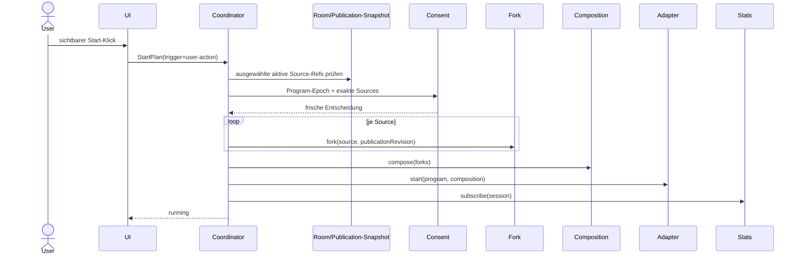

# Browser-Broadcast-Modul

Stand: 2026-09-03. `TBP-009` definiert Ports und Lifecycle; der
[Own-Source-Preflight](broadcast-own-source-preflight.md) aus `TBP-010` bindet
davon inzwischen Source-Auswahl und Capture-Fork sichtbar in Angular ein.

Das Browser-Modul legt die kleinen Softwareports und den deterministischen
Lifecycle für spätere Broadcast-Publisher und -Player fest. Es aktiviert noch
keinen produktiven Broadcastpfad: Eigene Preview-Forks sind vorhanden; WHIP,
LL-HLS und ein Zuschauer-Player sind weiterhin nicht angeschlossen. Diese
Fähigkeiten folgen in eigenen Todo-Schritten.

## Verantwortungen

| Port oder Service | Alleinige Verantwortung |
|---|---|
| `BroadcastProgramStateService` | lokaler Program-Lifecycle und sichtbarer Fehlerstatus |
| `BroadcastConsentPort` | explizite, kurzlebige Zustimmung für genau Program-Epoch und Quellen |
| `BroadcastSourceSelectionService` | Auswahl aus einem übergebenen Room-/Publication-Snapshot |
| `BroadcastCaptureForkPort` | späterer, ausdrücklich gestarteter Fork einzelner Quellen |
| `BroadcastCompositionPort` | Zusammensetzen freigegebener Forks ohne UI-Policy |
| `BroadcastPublicationPort` | Start und Stop genau einer Adapter-Publikation |
| `BroadcastDeliveryCapabilityService` | ehrliches Adapterinventar und Capability-Prüfung |
| `BroadcastPlaybackPort` | Öffnen und Schließen einer getrennten Zuschauer-Session |
| `BroadcastStatsPort` | begrenzte technische Samples und kündbare Subscription |

`BroadcastCoordinatorService` orchestriert diese Ports, besitzt aber weder
Tokens noch `RTCPeerConnection`-Policy. `BroadcastPlaybackService` hält den
Viewer-Lifecycle separat. UI-Komponenten sollen später ausschließlich
validierte User-Intent-Objekte an diese Services übergeben.

## Start- und Cleanup-Reihenfolge

Ein Startplan ist geschlossen, höchstens 64 KiB groß und muss
`trigger: "user-action"` enthalten. Unbekannte Felder, eine fremde Room-ID,
doppelte oder inaktive Quellen sowie ungültige IDs werden vor Consent und
Capture abgewiesen.

Stop, Abort, Retry und Destroy räumen strikt rückwärts auf: Stats-Subscription,
Publication, Composition und zuletzt Source-Forks. Jeder Cleanup-Schritt wird
auch dann versucht, wenn ein anderer fehlschlägt. Ein fehlgeschlagenes Handle
bleibt für einen erneuten Stop erhalten; erfolgreich entfernte Handles werden
nicht doppelt beendet. Danach wird die lokale Source-Auswahl geleert. Ein
Broadcast-Panel allein ruft keinen Consent-, Capture- oder Playback-Port auf.

## State- und Trust-Grenzen

- Der Service bekommt einen unveränderlichen Snapshot vom bereits besitzenden
  Room-/Publication-State. Er liest oder erzeugt keine zweite globale
  Peer-Liste.
- Nur Source-IDs des aktuellen Snapshot und seiner `sessionInstanceId`/
  `publicationRevision` dürfen verwendet werden. Destroy entfernt die lokalen
  Referenzen.
- Consent, Composition, Publication, Playback und Stats werden nach Rückkehr
  erneut strukturell und gegen Program-/Source-Epoch geprüft. Ungültige
  Adapterantworten sind kein impliziter Erfolg.
- Der Own-Source-Fork entsteht ausschließlich aus dem vom
  `MediaPublicationService` besessenen Originaltrack vor dem
  SFrame-Raumsender. `TBP-010` implementiert und testet diesen Track-Lifecycle.
- Broadcast ist ein bewusst entschlüsselter Zusatzpfad. Dieses Modul ändert
  weder den bestehenden SFrame-Raumpfad noch Membership oder Relay-Autorität.

## Ehrliche Adapter-Capabilities

WHIP-, Native-Bridge-, Provider- und Mock-Adapter implementieren denselben
kleinen Publication-Port. Ein Adapter ohne Transport meldet `available: false`
mit einem maschinenlesbaren Grund und wirft beim Start; er simuliert keine
Session. Der Mock ist ausschließlich für deterministische Tests verfügbar.
Der WHIP-Adapter meldet Simulcast noch als nicht vorhanden. Ein konkreter
RFC-9725-Transport folgt in `TBP-011`.

## Verifikation

Die Unit-Tests prüfen insbesondere:

- kein Capture oder Playback durch Konstruktor oder Panel-Öffnung,
- geschlossene User-Intent-Validierung,
- feste Start- und umgekehrte Stop-Reihenfolge,
- Abort vor Capture sowie Cleanup nach Teilfehlern,
- expliziten Retry ohne versteckten Neustart,
- wiederholbares Cleanup nach Stopfehlern,
- ehrliche unavailable-Capabilities und zustandsbehafteten Mock,
- Playback-Destroy und wiederholbares Schließen.
