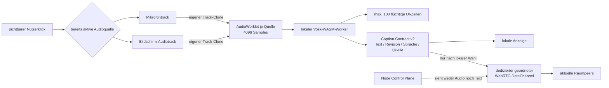

# Lokale Live-Untertitel mit Vosk

Stand: 2026-09-02. Die Angular-Anwendung kann Sprache freiwillig und lokal im
Browser erkennen. Als Quelle dient wahlweise ein bereits laufendes Mikrofon
oder der bereits freigegebene Bildschirmton. Audio wird weder an den Node-
Server noch an Vosk- oder andere Cloud-Dienste übertragen. Begrenzte
Textupdates bleiben nach Wahl lokal oder werden an bereits verbundene
Raumpeers gesendet.

## Bedienung

1. Unter **Untertitel** ein Modell auswählen und **Modell direkt laden**
   anklicken. Auswahl und Download öffnen kein Mikrofon.
2. Einem Raum beitreten und unter **Live** das Mikrofon starten oder unter
   **Einstellungen → Video & Bandbreite** Bildschirmton aktivieren und danach
   bewusst einen Tab/Bildschirm mit Ton teilen. Die Untertitelansicht startet
   selbst keine Aufnahme.
3. **Mikrofon** oder **Bildschirmton** auswählen und vor dem Start festlegen,
   ob der erkannte Text nur lokal bleibt oder mit dem Raum geteilt wird.
4. Die gewünschte Quelle starten. Beide Quellen können mit getrennten
   Recognizern parallel laufen und einzeln gestoppt werden.
5. Die Einblendung über den Videokacheln kann lokal ein- oder ausgeschaltet
   werden. **Untertitel stoppen**, Mikrofon-Stopp, Leave, Logout oder das
   Schließen der Seite beendet die betroffene beziehungsweise gesamte
   Erkennung. Endet nur der Bildschirm-Audiotrack, läuft ein aktiver Mikrofon-
   Recognizer weiter.

Nur der Sprecher benötigt das Sprachmodell. Andere Teilnehmer erhalten dessen
Text auf dem bereits bestehenden WebRTC-Pfad und müssen dafür weder ein Modell
laden noch ihr Mikrofon freigeben. Erkennungsergebnisse können falsch sein und
sind keine belastbare Gesprächsdokumentation.

## Direkt nachladbarer Modellkatalog

Die Anwendung akzeptiert keine frei eingegebenen URLs. Alle Einträge zeigen auf
einen unveränderlich gepinnten Stand des browsergeeignet verpackten
[`vosk-browser`-Katalogs](https://github.com/ccoreilly/vosk-browser/tree/a4b0d0fe60359e5ea9800f810f6b6f6c1d2b03c6/models).
Dateigröße und gzip-Kennung werden vor der Ausführung geprüft.

| Sprache | BCP-47 | Modell | Download | Lizenz |
|---|---|---|---:|---|
| Deutsch | `de-DE` | `de-de-small-0.15` | 46,5 MB | Apache-2.0 |
| Englisch (USA) | `en-US` | `en-us-small-0.15` | 41,2 MB | Apache-2.0 |
| Englisch (Indien) | `en-IN` | `en-in-small-0.4` | 37,6 MB | Apache-2.0 |
| Spanisch | `es-ES` | `es-es-small-0.3` | 34,5 MB | Apache-2.0 |
| Französisch | `fr-FR` | `fr-fr-small-pguyot-0.3` | 46,0 MB | CC-BY-NC-SA-4.0 |
| Italienisch | `it-IT` | `it-it-small-0.4` | 34,3 MB | Apache-2.0 |
| Portugiesisch (Brasilien) | `pt-BR` | `pt-br-small-0.3` | 32,4 MB | Apache-2.0 |
| Katalanisch | `ca-ES` | `ca-es-small-0.4` | 43,4 MB | Apache-2.0 |
| Mandarin-Chinesisch | `zh-CN` | `zh-cn-small-0.3` | 33,2 MB | Apache-2.0 |
| Persisch | `fa-IR` | `fa-ir-small-0.4` | 48,7 MB | Apache-2.0 |
| Russisch | `ru-RU` | `ru-ru-small-0.4` | 40,8 MB | Apache-2.0 |
| Türkisch | `tr-TR` | `tr-tr-small-0.3` | 36,8 MB | Apache-2.0 |
| Vietnamesisch | `vi-VN` | `vi-vn-small-0.3` | 33,7 MB | Apache-2.0 |

Das französische Modell ist wegen seiner nicht-kommerziellen Lizenz in der UI
sichtbar gekennzeichnet. Die offiziellen Vosk-ZIP- und großen Servermodelle
werden im Link zum [offiziellen Vosk-Katalog](https://alphacephei.com/vosk/models)
gezeigt, aber nicht als direkt browserkompatibel ausgegeben: `vosk-browser`
erwartet ein speziell aufgebautes gzip-Tar-Archiv.

Ein geladenes Archiv liegt, soweit der Browser Cache Storage zulässt, lokal in
diesem Browserprofil. Private Modi oder Speicherbereinigung können es jederzeit
entfernen. Der entpackte Zustand lebt ausschließlich im Worker-Speicher; der
Build deaktiviert den zusätzlichen, von `vosk-browser` sonst intern angelegten
IDBFS-Cache. **Lokale Kopie löschen** beendet ein gegebenenfalls residentes
Modell und entfernt dessen sichtbaren Cache-Eintrag. Es ist immer höchstens ein
Modell gleichzeitig im Worker aktiv.

## Daten- und Vertrauenspfad

Der `captions`-DataChannel ist zuverlässig und geordnet. Sein Contract ist
additiv versioniert. Version 2 akzeptiert ausschließlich die exakten Felder
`version`, `type`, `utteranceId`, `revision`, `language`, `text`, `final` und
`source`; die Quelle ist nur `microphone` oder `screen-audio`. Exakte
Version-1-Nachrichten bleiben kompatibel und werden als Mikrofonuntertitel
interpretiert.
Grenzen sind 500 Zeichen je Text, 2.048 Byte je Nachricht, 64 KB
DataChannel-Backpressure und 24 Updates pro Peer in fünf Sekunden. Revisionen
müssen monoton sein; unbekannte Felder oder Typen werden verworfen. Der
angezeigte Sprecher stammt aus der vorhandenen, serverautorisierten
PeerConnection und niemals aus dem Text-Payload.

WebRTC schützt diesen Peer-zu-Peer-Text per DTLS/SCTP auch auf einem TURN-Pfad.
Jeder berechtigte Empfänger sieht den Klartext im eigenen Browser. Der Caption-
Kanal nutzt nicht den separaten anwendungsseitigen AES-GCM-Overlay und läuft
nicht über den nativen Media-Agenten. Der Signaling-Server terminiert,
protokolliert und persistiert keine Caption-Nachricht.

## Laufzeitisolation und Browsergrenzen

`vosk-browser` 0.0.8 enthält einen rund 4,3 MB großen, selbstständigen
WebAssembly-Worker. Der Build extrahiert ausschließlich den erwarteten Worker
mit festgelegtem SHA-256-Digest. Die Angular-Hauptanwendung lädt ihn erst beim
expliziten Modellstart. Die alte Emscripten-Bindingschicht benötigt
`unsafe-eval`; diese CSP-Ausnahme gilt ausschließlich für die HTTP-Antwort
`/assets/vosk-worker.js`. Die Hauptanwendung behält
`script-src 'self' 'wasm-unsafe-eval'` ohne allgemeines `unsafe-eval`.

Die Apache-2.0-Lizenz des Workers wird im Build als
`/assets/vosk-worker.LICENSE.txt` direkt neben dem Worker ausgeliefert. Herkunft
und Reproduktionshinweise liegen unter `third_party/vosk-browser/`.

Erforderlich sind Worker, WebAssembly, AudioWorklet und ein Secure Context.
Chromium und Firefox werden automatisiert auf Katalog, expliziten Download und
Capture-Freiheit geprüft. Fehlt AudioWorklet, bleibt Start sichtbar deaktiviert;
es gibt keinen stillen Cloud- oder Serverfallback. Mobile Geräte können wegen
Entpacken, Modellzustand und WASM deutlich mehr RAM als die angegebene
Downloadgröße benötigen und mehr Akku verbrauchen.

## Lifecycle und Verifikation

- Jeder AudioGraph verwendet nur einen Clone eines bereits laufenden Mikrofon-
  oder Bildschirm-Audiotracks und einen auf null gesetzten Ausgang; er spielt
  das Signal nicht erneut ab.
- Beide Quellen teilen höchstens ein geladenes Modell, besitzen aber getrennte
  Recognizer, Worklets, AudioContexts, Revisionen und Timer. Das Ende einer
  Quelle schließt nur deren Pipeline; der Worker endet nach der letzten Quelle.
- Stop, Quellenende, Leave, Logout, Modellwechsel und Destroy schließen die
  betroffenen Ressourcen idempotent.
- Teilresultate werden höchstens alle 250 ms gesendet; Finalresultate sofort.
- Der sichtbare Verlauf ist auf 100 Einträge begrenzt und verschwindet beim
  Verlassen oder Zerstören der Raumsitzung. Es entsteht keine Transkriptdatei.
- Unit-Tests prüfen Modell-Allowlist, Runtime-Abbruch, Cleanup, Contract,
  Backpressure, Rate und Sprecherbindung. Der Browser-Gate prüft Chromium und
  Firefox ohne Capture; lokale Live-Smokes verwenden zusätzlich zwei Chromium-
  Identitäten, ein echtes WASM-Modell, AudioWorklet sowie einen bewusst
  bereitgestellten Bildschirm-Audiotrack.
