# Aktuelle WebRTC-Architektur als UML-/Datenflussmodell

Stand: 2026-09-01, bezogen auf den aktuellen `main`-Stand. Die Diagramme
beschreiben die implementierte Architektur einschliesslich selektivem
Simulcast-SFU und nativer Agent-Foederation, nicht einen portablen
Browser-Ciphertext-DAG. Sie verwenden Mermaid, damit GitHub sie direkt rendert.

## 1. Begriffe und unveraenderliche Grenzen

- **Control Plane:** Node-Server fuer OIDC-Pruefung, Raum-Membership,
  kurzlebige Peer-IDs, Signaling, ICE-Konfiguration, Topologien und
  Agent-Leases. Er transportiert keine Medienframes.
- **Browser Data Plane:** getrennte Publikationen fuer Mikrofon, Kamera,
  Bildschirm und optionalen Bildschirmton; WebRTC-Medien und DataChannels.
- **Blind Media Edge Agent:** nativer Pion-Prozess. Er terminiert
  ICE/DTLS-SRTP, leitet aber nur bereits SFrame-verschluesselte RTP-Payloads
  weiter und erhaelt keinen SFrame-Schluessel.
- **TURN Edge Agent:** freiwilliger Pion-TURN-Server. Er hilft nur beim
  ICE-Netzpfad und reduziert weder Publisher-Fanout noch PeerConnections.
- **Trusted Browser Relay:** separater, consentierter Video-Baum fuer den
  Modus ohne Media-E2EE. Er kann Klarframes verarbeiten und ist im aktuellen
  Produktionsmodus `MEDIA_E2EE_MODE=required` deshalb nicht aktiv.
- **Control Plane besitzt Autoritaet:** Ein Browser oder Agent darf aus SDP,
  ICE, RTP oder einem DataChannel weder Membership noch neue Rechte ableiten.

## 2. Systemkontext und Vertrauensgrenzen

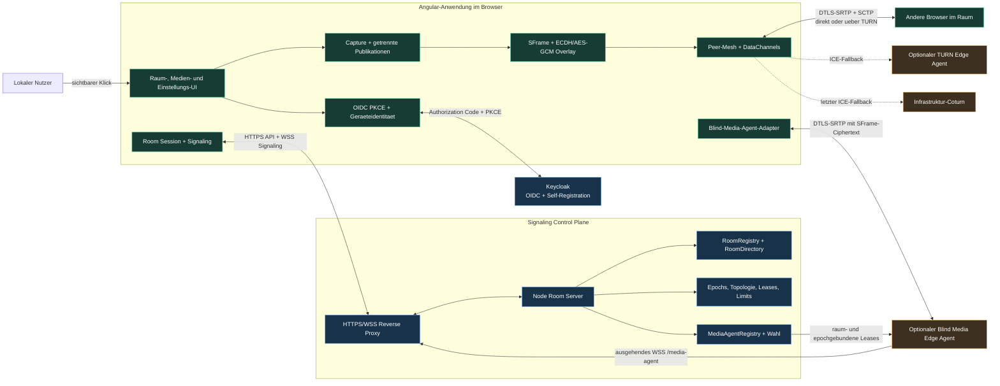

Die Control Plane sieht Identitaet, Raumzugehoerigkeit, Signaling-Metadaten,
Agentzustand und Netzmetadaten. Audio-, Video-, Bildschirm- und Chat-Inhalte
laufen in der Data Plane. Keycloak-Tokens werden weder in WebSocket-Nachrichten
noch in Medienpfade geschrieben; der Signaling-WebSocket verwendet ein
kurzlebiges Einmal-Ticket.

## 3. Interne Modulaufteilung

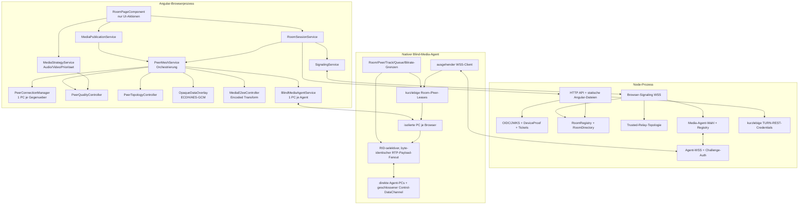

Die UI besitzt keine Token-, Schluessel-, Membership- oder
`RTCPeerConnection`-Policy. Capture startet nur nach einem sichtbaren lokalen
Klick. Mikrofon, Kamera, Bildschirm und Bildschirmton bleiben getrennt und
koennen unabhaengig gestoppt werden.

## 4. Identitaet, Raumbeitritt und Signaling

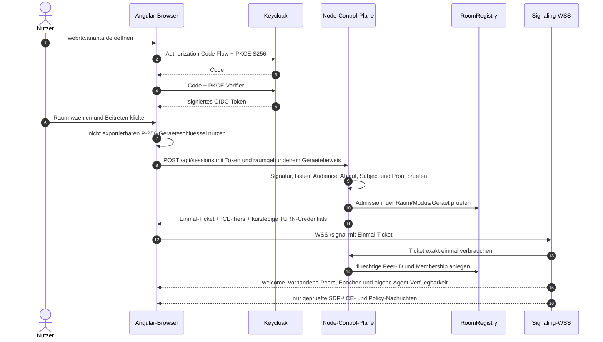

Der Raumcode ist nur ein Invite. Nutzeridentitaet kommt aus dem verifizierten
OIDC-Principal `issuer|subject`; die Browserinstanz wird zusaetzlich durch den
frischen P-256-Geraetebeweis gebunden.

## 5. Pfad ohne Blind-Media-Agent: required-SFrame Direct Mesh

### 5.1 Topologie

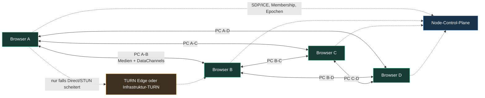

Bei `N` Teilnehmern besitzt jeder Browser bis zu `N - 1` direkte
PeerConnections. Audio, Kamera, Bildschirm und Bildschirmton werden jeweils
als eigene lokale Publikation an jeden anderen Browser gesendet. Chat,
Aktivitaet, Qualitaetsmeldungen und der verschluesselte Daten-Overlay laufen
ueber SCTP-DataChannels derselben PeerConnections.

### 5.2 Eine Publikation von A nach B

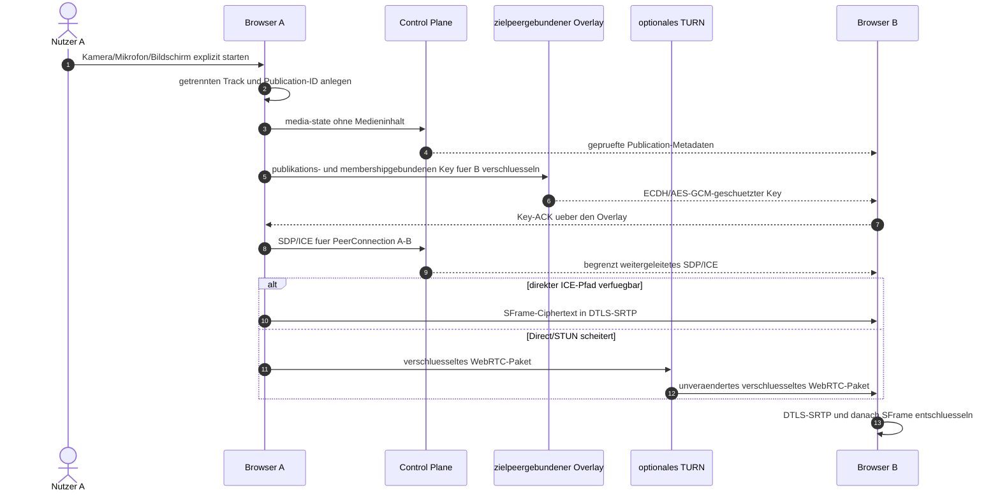

Der Key-Handshake akzeptiert nur Protokollversion 2 mit
`frameEnvelope=codec-prefix-v1`. Vor dem SFrame-Header bleiben bei VP8 zehn
Keyframe- oder drei Deltaframe-Bytes und bei Opus ein TOC-Byte sichtbar, damit
der Browser-Packetizer den Codecframe korrekt klassifiziert. Dieser Praefix
und der versionierte Envelope-Header sind AES-GCM Additional Authenticated
Data; Manipulation verwirft den Frame. Der restliche Codecframe bleibt
verschluesselt. Alte Formate, unbekannte Codecs oder ein fehlender Transform
erzeugen im `required`-Modus keinen Klartextpfad.

TURN aendert hier nur den Netzpfad. A muss weiterhin fuer B, C, D und alle
weiteren Teilnehmer je einen WebRTC-Sender bedienen. Ein TURN Edge Agent ist
daher kein Fanout-Server.

## 6. Pfad mit einem Blind-Media-Agenten

### 6.1 Consent, Route und sicherer Umschaltpunkt

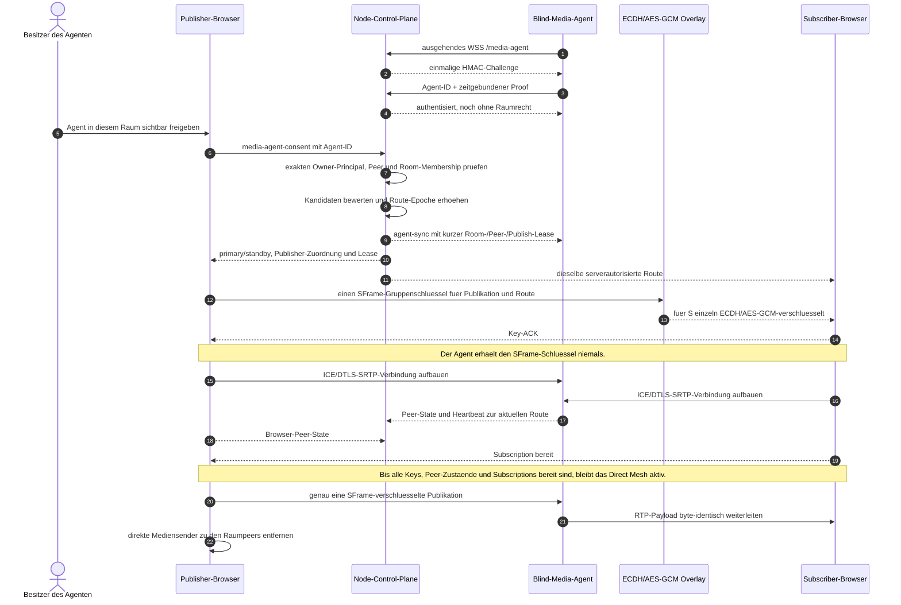

Der Agent terminiert fuer jeden Browser eine eigene ICE-/DTLS-/SRTP-Sitzung.
Er sieht deshalb IP-Adressen, Timing, SSRCs, Codec-Metadaten und Datenraten.
Der Medienframe im RTP-Payload bleibt SFrame-Ciphertext. Der Agent dekodiert
und re-encodiert nicht und besitzt keinen Decrypt-Port.

### 6.2 Logischer Datenfluss bei fuenf Teilnehmern

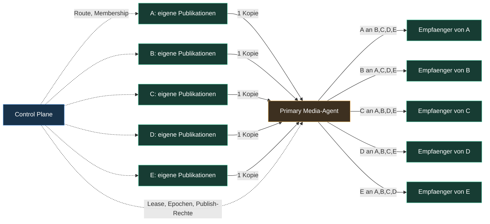

Die Browser behalten ihre direkten PeerConnections fuer DataChannels,
Membership-nahe Steuerdaten und den sofortigen Medienrueckfall. Der
Media-Agent reduziert den Medienfanout des Publishers, nicht zwingend die
Gesamtzahl offener PeerConnections.

### 6.3 Entscheidung fuer drei bis sechs Teilnehmer

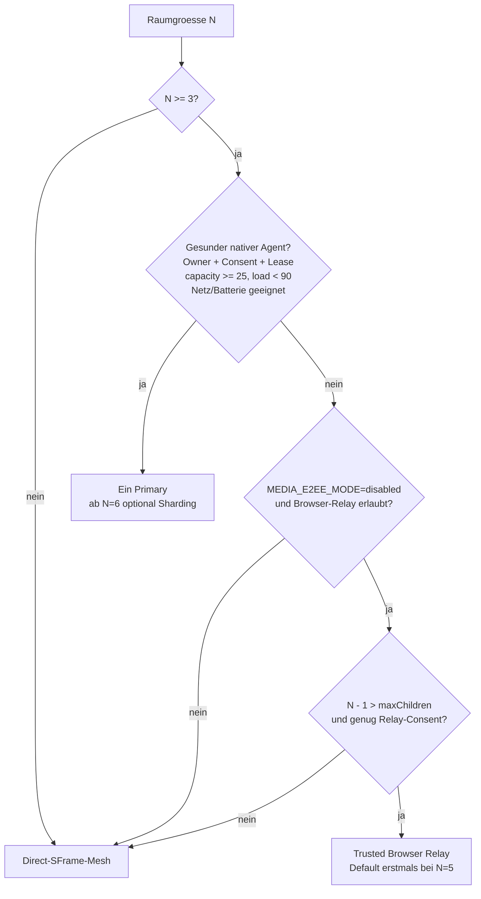

Der native Agent und der Browser-Relay verwenden bewusst verschiedene
Nutzenkriterien. Ein nativer Agent nimmt einem Publisher ab drei Teilnehmern
mindestens eine Zielkopie ab. Ein Browserbaum mit `maxChildren=3` reduziert
den Root-Fanout dagegen erst von vier auf drei, also bei fuenf Teilnehmern;
bei `maxChildren=2` waere der erste Vorteil bei vier. Im produktiven
`required`-SFrame-Modus ist der entschluesselnde Browserbaum deaktiviert.

## 7. Selektiver Simulcast-SFU und direkte Agent-Foederation

Ab `MEDIA_AGENT_MIN_PARTICIPANTS` (Default `3`) darf ein geeigneter,
raumgebunden consentierter Primary Forwarder werden; ein Raum mit zwei
Teilnehmern bleibt direkt. Unterhalb von `MEDIA_AGENT_SHARD_MIN_PARTICIPANTS`
(Default `6`) bleibt dieser Primary der einzige Forwarder. Ab dem Schwellwert
werden Primary und vorhandene
Standbys zu bis zu drei Forwardern. Die Control Plane weist jedem Publisher
genau einen Ingress und jedem Subscriber hoechstens einen Egress zu. Die beiden
Zuordnungen sind getrennte Contract-Felder; aktuell verwendet der deterministische
Plan fuer einen Browser denselben Agenten als Ingress und Egress.

Kamera wird am Browser als `q`/low, `h`/medium und `f`/high ausgehandelt. Ein
Subscriber waehlt anhand Active Speaker, Medienstrategie, Linkklasse und seiner
lokalen Maximalstufe genau einen Layer. Der Egress bindet fuer diese
Subscription nur diesen RTP-Layer; Audio, Bildschirm und Bildschirmton bleiben
je ein separater Single-Layer. Der Agent verarbeitet den SFrame-Payload nicht.

Die lokale Maximalstufe ist das allgemeine Empfangsprofil desselben Browsers,
nicht mehr eine Agent-Sondereinstellung. Im Direct Mesh sendet der Browser sie
als geschlossenen `receive-quality`-Intent an jede Gegenstelle; dort begrenzt sie
nur den separaten `RTCRtpSender` zu diesem Ziel. Im Agent-Pfad begrenzt sie die
eigene Kamera-Subscription. `audio-only` deaktiviert Kamera und Bildschirm,
aber nicht Mikrofon oder Bildschirmton. Der gemeinsame Single-Layer-Bildschirm
des Agenten besitzt keine individuellen low/medium-Varianten. Ein Browser, der
im entschluesselnden Legacy-Modus als Zwischenrelay dient, muss seinen
gemeinsamen Eingang fuer die Nachgelagerten behalten; seine persoenliche
Empfangswahl darf deren Qualitaet nicht absenken.

### 7.1 Beispiel: acht Browser, zwei direkt verbundene Agenten

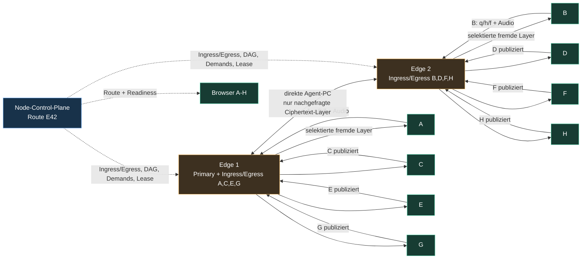

Jeder Browser unterhaelt fuer Medien nur seine zugewiesene Agent-Verbindung.
Edge 1 liefert deshalb auch die von Edge 2 kommenden Publikationen an A, C, E
und G; Edge 2 liefert die von Edge 1 kommenden Publikationen an B, D, F und H.
DataChannels und der Direct-SFrame-Fallback zwischen Browsern bleiben davon
getrennt bestehen.

| Browser | Eigener Medienupload | Medienempfang | Cross-Agent-Bedarf |
|---|---|---|---|
| A, C, E, G | je eine Publikation zu Edge 1 | alle gewaehlten Layer von Edge 1 | B, D, F, H laufen E2 -> E1 |
| B, D, F, H | je eine Publikation zu Edge 2 | alle gewaehlten Layer von Edge 2 | A, C, E, G laufen E1 -> E2 |

Wenn A fuer B `high`, fuer D `medium` und fuer F/H nur `low` benoetigt, muss
Edge 1 auf dem gemeinsamen Link drei Ciphertext-Layer von A senden. Edge 2
verteilt danach an jeden Empfaenger genau den gewaehlten Layer. Fordern alle
vier nur `low`, laeuft ueber den Agent-Link genau eine A-Layer-Kopie, die Edge 2
lokal vervielfaelt.

### 7.2 Drei Agenten: serverautorisierter DAG

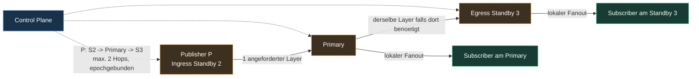

Der Primary ist der einzige Hub; bei maximal zwei Standbys existieren hoechstens
zwei Agent-Links. Pro Publisher sind Kanten gerichtet, topologisch geordnet und
maximal zwei Hops tief. Agenten duerfen weder eine Kante umdrehen noch einen
neuen Nachbarn, Publisher oder Layer aus SDP, ICE, RTP oder direktem JSON
ableiten.

### 7.3 Koordination und sicherer Umschaltpunkt

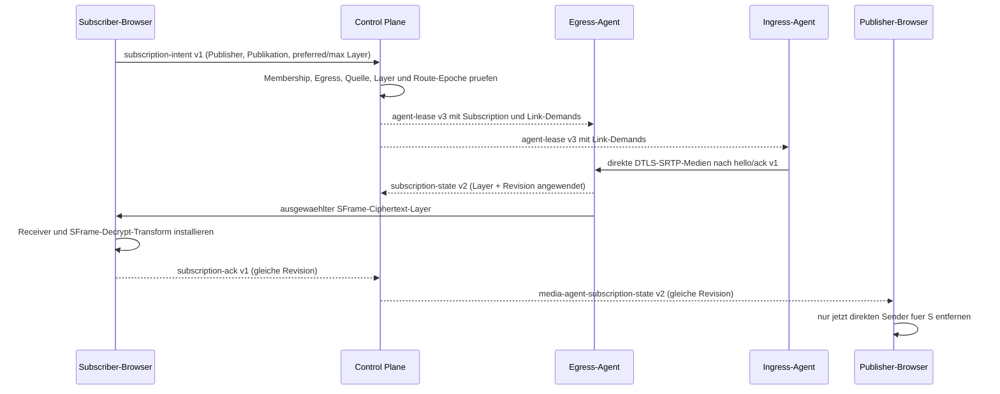

Die direkte Agent-Control-Verbindung tauscht nur geschlossene
`federation-hello`, `federation-ack` und begrenzte `federation-stats` aus.
SDP/ICE wird von der Control Plane fuer den exakten Link vermittelt. Diese
JSON-Daten sind keine Policy-Verhandlung. Die Zuordnung ist deterministisch
nach Publisher-Anzahl, noch nicht nach gemessener Publikationsbitrate;
`capacity`, `load`, Netzklasse, Batterie und Heartbeat beeinflussen die
Kandidatenwahl, sind aber keine Bandbreitenreservierung oder QoS-Garantie.

## 8. Wahl, Consent, Failover und Mesh-Rueckfall

### 8.1 Wahlzustand

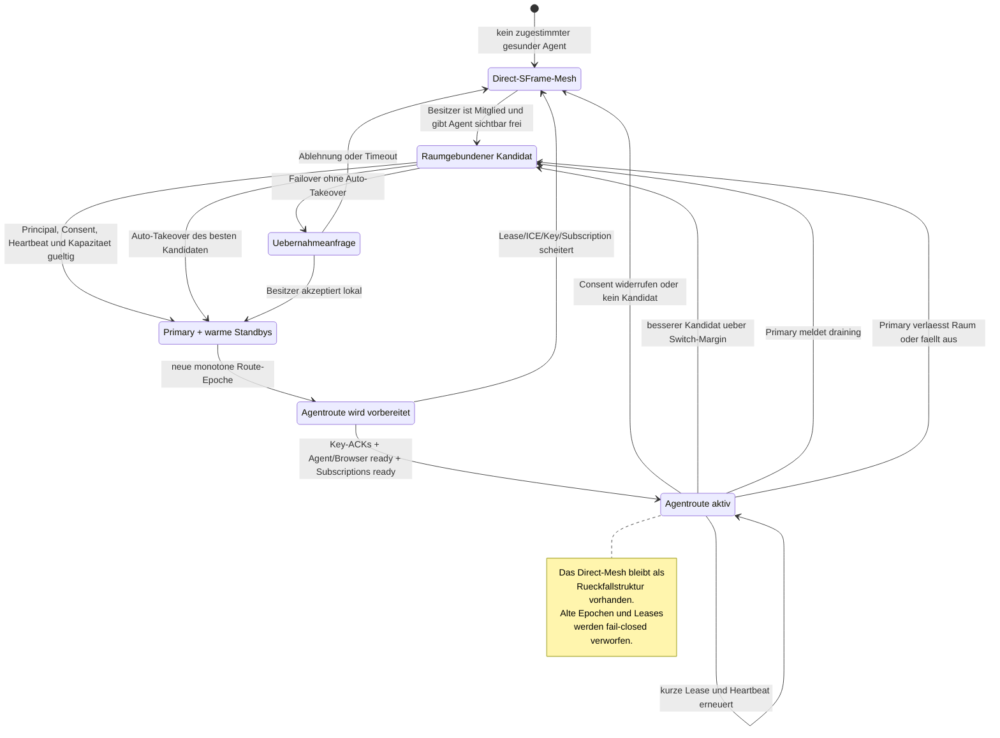

### 8.2 Aktuelle Bewertungslogik

Ein Agent wird nur Kandidat, wenn:

1. seine Agent-ID serverseitig an den exakten OIDC-Principal gebunden ist,
2. genau dieser Nutzer im betreffenden Raum Mitglied ist,
3. er den Agenten in diesem Raum im Browser freigegeben hat,
4. Agent-WSS und Heartbeat frisch sind,
5. `maxRooms`, `maxPeers`, mindestens 25 Prozent freie gemeldete Kapazitaet
   und weniger als 90 Prozent Last passen,
6. der Agent weder `draining`, unsichtbar, batterie-kritisch noch
   netzbeschraenkt ist.

Die aktuelle Punktzahl lautet vereinfacht:

```text
Score = Creator-Bonus (240)
      + Batterie (mains 90, unknown 35, limited 10)
      + Netz (fast 100, normal 60, unknown 25)
      + 2 * capacity (0..100)
      - load (0..100)
```

Ein gesunder aktueller Primary wird erst gewechselt, wenn ein anderer Kandidat
mindestens `200` Punkte besser ist. Der Creator ist daher bevorzugt, aber nicht
bedingungslos gesetzt. Hoechstens zwei nachrangige Kandidaten werden Standby.

### 8.3 Raum- und Nutzerbindung

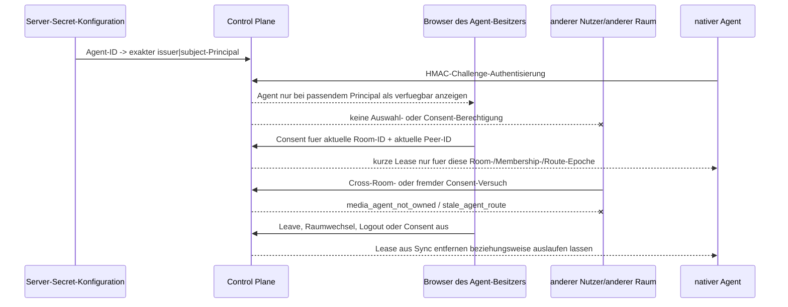

Teilnehmer desselben freigegebenen Raums duerfen den Agenten als Transportziel
der serverautorisierten Route verwenden. Sie erhalten weder Eigentum noch ein
Recht, ihn in einem anderen Raum einzusetzen. Derselbe Besitzer kann den
Agenten bewusst in mehreren eigenen Browserkontexten freigeben, solange die
gemeldete `maxRooms`-Grenze dies erlaubt; es gibt keine globale Fremdfreigabe.

## 9. Bandbreitenmodell

### 9.1 Variablen

Fuer eine uebersichtliche Rechnung gilt:

- `N`: Zahl der Raumteilnehmer, maximal 20.
- `D_i,j`: die fuer Empfaenger `j` gewaehlte Datenrate von Publisher `i`.
- `U_i`: Upload von `i` zum Agent-Ingress. Fuer Kamera-Simulcast ist dies die
  Summe der gleichzeitig aktiven `q`-, `h`- und `f`-Encodings plus Audio und
  andere Single-Layer-Publikationen.
- `L_i,a->b`: Menge unterschiedlicher Layer von `i`, die mindestens ein
  Subscriber hinter Agent-Link `a -> b` anfordert. Gleiche Layer werden auf
  dem Link nur einmal transportiert und am Egress vervielfaelt.
- `S_k`: Menge lokaler Publisher mit Ingress `k`; `R_k` ist die Menge lokaler
  Subscriber mit Egress `k`.
- Alle Werte unten sind Medien-Payload-Naeherungen ohne IP/UDP/TCP, TURN,
  ICE, DTLS, SRTP, SFrame, RTP/RTCP und SCTP-Overhead.

Simulcast spart nicht automatisch in jeder Kleingruppensituation: Muss ein
Publisher `q+h+f` einmal zum Agenten senden, kann dies teurer sein als wenige
reine Thumbnail-Direktpfade. Der Vorteil steigt mit Teilnehmerzahl und
unterschiedlichen Empfaengerstufen, weil jede Encoding-Stufe pro Agent-Link nur
einmal statt pro Subscriber uebertragen wird.

### 9.2 Formeln

| Modus | Browser `i` Upload | Browser `j` Download | Agent-/Linklast |
|---|---:|---:|---:|
| Direct Mesh | `sum(D_i,j), j != i` | `sum(D_i,j), i != j` | – |
| Ein Agent | `U_i` | `sum(D_i,j), i != j` | Ingress `sum(U_i)`; lokaler Egress `sum(D_i,j)` |
| Foederierte Agenten | `U_i` an genau einen Ingress | `sum(D_i,j), i != j` vom eigenen Egress | Link `a->b`: `sum(rate(layer), layer in L_i,a->b)`; danach lokaler Fanout |
| Sichere Umschaltphase | Direct-Summe plus `U_i` | zeitweise Direct plus Agent | wie Zielroute plus Uebergang |

Der notwendige Empfaenger-Download verschwindet nicht. Publisher-Fanout
wandert auf freiwillige Agenten; der Agent-Link aggregiert gleiche Layer, und
der Egress uebernimmt die Kopien fuer seine lokalen Subscriber.

### 9.3 Aktuelle Senderobergrenzen

| Quelle/Profil | implementierte Obergrenze vor Prioritaetsfaktor |
|---|---:|
| Sprache sparsam | 24 kbit/s |
| Sprache klar | 48 kbit/s |
| Musik Stereo | 128 kbit/s |
| Kamera Agent-Simulcast low (`q`) | 120 kbit/s, 6 FPS, 4x skaliert |
| Kamera Agent-Simulcast medium (`h`) | 420 kbit/s, 15 FPS, 2x skaliert |
| Kamera Agent-Simulcast high (`f`) | 1.200 kbit/s, 24 FPS |
| Kamera Direct-Thumbnail | 90 kbit/s, 3 FPS |
| Kamera in kleinen Raeumen bis 5 | hoechstens 400 kbit/s, 12 FPS |
| Kamera Balanced | 420 kbit/s, 15 FPS |
| Kamera Focus | 1.200 kbit/s, 24 FPS |
| Bildschirm | 2.500 kbit/s, 24 FPS |
| Direct-Empfangsprofil niedrig, Kamera | 120 kbit/s, 6 FPS, 4x skaliert |
| Direct-Empfangsprofil niedrig, Bildschirm | 600 kbit/s, 5 FPS, 2x skaliert |
| Direct-Empfangsprofil mittel, Bildschirm | 1.200 kbit/s, 12 FPS |

Die Medienprioritaet multipliziert Video fuer Rang 1/2/3 mit ungefaehr
`1.0`, `0.72` und `0.45` und begrenzt niedrigere Prioritaeten zusaetzlich bei
FPS. Linkklasse, Active Speaker, laufendes Screensharing und Datensparmodus
koennen weiter reduzieren oder Video pausieren. Browser duerfen
`RTCRtpSender.setParameters` teilweise ablehnen; die UI zeigt dann eine
degradierte Capability statt eine nicht bewiesene Garantie.

Beim Direct Mesh kann die Qualitaet je Empfaenger variieren. Beim nativen
Media-Agenten erzeugt der Publisher die drei Kamera-Encodings einmal. Der
Agent waehlt pro Subscriber eines davon, ohne neu zu kodieren. Bildschirm und
Audio bleiben jeweils ein gemeinsamer kodierter Layer. Der Ingress meldet die
tatsaechlich vorhandenen Layer; der serverautorisierte Demand verwendet exakt
den bevorzugten vorhandenen Layer, einen niedrigeren Fallback oder `single`.
Jede Umschaltung besitzt eine monotone Subscription-Revision, sodass ein altes
ACK den Direct-Fallback nicht vorzeitig entfernen kann.

### 9.4 Rechenbeispiel: fuenf Teilnehmer, ein Agent

Annahme: `48 kbit/s` Mikrofon und Kamera. Ein Publisher hat einen Focus-, einen
Balanced- und zwei Low-Empfaenger. Direct ergibt ungefaehr:

```text
1 * 1.200 + 1 * 420 + 2 * 120 + 4 * 48 = 2.052 kbit/s
```

Zum Agenten sendet derselbe Browser die drei Kamera-Encodings plus eine
Audiokopie:

```text
1.200 + 420 + 120 + 48 = 1.788 kbit/s
```

Der Browser spart in diesem Beispiel `264 kbit/s`; der Agent sendet zu den
vier Empfaengern zusammen wieder `2.052 kbit/s`. Fordern dagegen alle vier nur
Low an, waere Direct mit `4 * (120 + 48) = 672 kbit/s` guenstiger als alle drei
aktiven Simulcast-Layer. Deshalb darf Link-/Datenspar-Policy hohe Encodings am
Ingress deaktivieren. Bei fuenf Teilnehmern gibt es noch keine Foederation;
weitere Agenten bleiben ohne Browser-/Medienroute.

### 9.5 Rechenbeispiel: acht Teilnehmer, zwei Agenten

Edge 1 traegt A/C/E/G, Edge 2 B/D/F/H. Fuer jeden Publisher gelte wieder:
ein Focus-, zwei Medium- und vier Low-Empfaenger plus Audio.

| Wert je Publisher | Direct Mesh | Agent-Pfad |
|---|---:|---:|
| Browser-Upload | `1.200 + 2*420 + 4*120 + 7*48 = 2.856 kbit/s` | `1.200 + 420 + 120 + 48 = 1.788 kbit/s` |
| Einsparung am Browser | – | `1.068 kbit/s` beziehungsweise rund 37 % |

Liegen hinter dem anderen Agenten mindestens ein High-, Medium- und
Low-Empfaenger, transportiert der direkte Agent-Link fuer diesen Publisher
ebenfalls `1.788 kbit/s` genau einmal. Fordern die vier Cross-Shard-Subscriber
nur Low, sinkt dieser Linkanteil auf `120 + 48 = 168 kbit/s`; der Egress
erzeugt vier lokale Kopien. Jeder Browser empfaengt weiterhin seine
individuelle Gesamtrate.

Wenn A zusaetzlich einen Bildschirm mit `2.500 kbit/s` sendet, kostet das im
Direct Mesh bis zu weitere `7 * 2.500 = 17.500 kbit/s` Upload bei A. Mit Agent
sendet A eine weitere `2.500-kbit/s`-Kopie an Edge 1. Edge 1 sendet eine Kopie
ueber den Agent-Link, falls mindestens ein E2-Subscriber den Bildschirm
abonniert; beide Egress-Agenten uebernehmen ihren lokalen Fanout.

### 9.6 Kapazitaetsblick auf 20 Teilnehmer

Mit 20 Teilnehmern und drei Agenten liegen hoechstens 19 direkte
Browser-Empfaenger einem einzigen Publisher gegenueber, aber nur zwei
Agent-Links. Bei drei aktiven Kamera-Layern plus Audio bleibt dessen
Browser-Agent-Upload im obigen Profil etwa `1.788 kbit/s`; Direct koennte bei
19 High-Empfaengern bis zu `19 * (1.200 + 48) = 23.712 kbit/s` erreichen. Pro
Agent-Link laeuft jeder dort benoetigte Layer nur einmal, der lokale Egress
traegt aber weiterhin bis zu sieben Subscriber-Kopien.

Das ist eine Kapazitaetsrechnung, kein 20-Teilnehmer-QoS-Nachweis. Die Agenten
haben harte Room-/Peer-/Track-/Queue- und Eingangsbitrate-Grenzen; physischer
Upload, Paketverluste, Codecverhalten und TURN koennen vorher begrenzen. Die
aktuelle Zuordnung verteilt Publisherzahlen, nicht gemessene Egress-Bitraten.
Der reale Mehrbrowser-/Mehragent-/NAT-Gate BME-006/BME-011 bleibt offen.

### 9.7 TURN-Effekt

TURN veraendert die logische Rechnung nicht, fuegt aber pro betroffener
PeerConnection einen Relay-Hop hinzu:

```text
Sender -> TURN -> Empfaenger
```

Ein logisch uebertragenes Mbit/s erzeugt am TURN ungefaehr ein Mbit/s Ingress
und ein Mbit/s Egress, jeweils plus Protokolloverhead. Wenn Browser-Agent-
Verbindungen TURN benoetigen, gilt dasselbe fuer jeden dieser Pfade. Der
freiwillige TURN Edge Agent und Infrastruktur-Coturn koennen deshalb selbst
zum Bandbreitenengpass werden, ohne den Anwendungsfanout zu reduzieren.

## 10. Datenarten und Empfaenger

| Datenart | Sender | Empfaenger ohne Media-Agent | Empfaenger mit Media-Agent | Darf die Control Plane Inhalt sehen? | Darf der Media-Agent Klarinhalt sehen? |
|---|---|---|---|---|---|
| Mikrofon | lokaler Browser nach Klick | jeder Raumpeer direkt/TURN | Ingress, benoetigte Agent-Links, jeweiliger Egress | nein | nein, SFrame-Ciphertext |
| Kamera | lokaler Browser nach Klick | jeder Raumpeer direkt/TURN | q/h/f zum Ingress; je Subscriber ein Layer ueber Egress | nein | nein, SFrame-Ciphertext |
| Bildschirmvideo | lokaler Browser nach Klick | jeder Raumpeer direkt/TURN | Single-Layer ueber Ingress/Foederation/Egress | nein | nein, SFrame-Ciphertext |
| Bildschirmton | lokaler Browser nach separater Zustimmung | jeder Raumpeer direkt/TURN | Single-Layer ueber Ingress/Foederation/Egress | nein | nein, SFrame-Ciphertext |
| Chat/Control | Browser | direkte SCTP-DataChannels | weiterhin Browser-DataChannels | nein | nein, kein Medien-Agent-Pfad |
| Overlay-Nutzdaten/Keys | Zielbrowser | direkter oder serverautorisierter Peer-Overlay | weiterhin Peer-Overlay, niemals Agent | nur Ciphertext/Metadaten | nein, nicht beteiligt |
| SDP/ICE | Browser/Agent | ueber Node an geprueften Raumpeer | ueber Node an geprueften Agent/Peer | ja, aber nicht loggen | nur eigene ICE-/SDP-Sitzung |
| Membership/Epochen/Leases | Node | alle Raumpeer-Browser | Browser und ausgewaehlte Agenten | ja, autoritativ | nur eigener Lease-Ausschnitt |

## 11. Drei verschiedene Relay-Arten

| Eigenschaft | TURN Edge / Coturn | Trusted Browser Relay | Blind Media Edge Agent |
|---|---|---|---|
| Aufgabe | NAT-/Firewall-Paketpfad | Video-Baum zwischen Browsern | Publisher-Fanout auf nativen Forwarder verlagern |
| Reduziert Publisher-Mediensender? | nein | fuer Video im Relay-Baum | ja, nach Readiness |
| Reduziert PeerConnections? | nein | nein | nein; zusaetzliche Agent-PCs |
| Medienkenntnis | nur verschluesselte DTLS-SRTP-Pakete | Browser kann Klarframes verarbeiten | DTLS-SRTP terminiert, SFrame bleibt blind |
| Aktueller required-SFrame-Produktionspfad | als ICE-Fallback erlaubt | deaktiviert | optional nach Raumconsent |
| Raum-/Membership-Autoritaet | keine | keine | keine |
| Consent | Infrastruktur-/Betreiberkonfiguration | pro Browser und Raum | Agent-Besitzer pro Raum und Peer |
| Koordination mehrerer Knoten | ICE waehlt Kandidaten | serverautorisierte zyklenfreie Baeume | Control Plane autorisiert Ingress/Egress und max. zweistufigen direkten Agent-DAG |

## 12. Aktuell beobachtetes Deployment

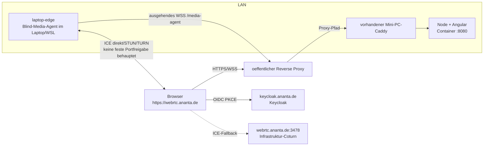

Der laufende `laptop-edge` ist der Blind-Media-Agent. Der getrennte freiwillige
TURN-Edge-Prozess ist eine andere Anwendung und wird ohne nachgewiesene
Router-/Firewall-Erreichbarkeit nicht als produktiver ICE-Tier behauptet.

## 13. Was die Architektur bewusst nicht verspricht

- Kein Browser oder Agent kann ohne aktuelle Control-Plane-Membership neue
  Raumteilnehmer oder Routen autorisieren.
- Ein vorhandener Medienpfad ist nicht dauerhaft serverlos: Membership,
  Epochen und kurze Agent-/Topologie-Leases muessen erneuert werden.
- Der Blind-Media-Agent schuetzt den Medieninhalt durch SFrame, nicht IP,
  Timing, SSRC, Codec-Metadaten, Paketgroessen oder Traffic-Analyse.
- Der native Pfad waehlt vorhandene Simulcast-Layer selektiv, erzeugt aber
  keine neuen Aufloesungen per Transcoding und bietet keine reservierte QoS.
- Der Agent-DAG hat hoechstens drei Agenten und zwei Hops; er ist kein
  beliebig skalierbares, selbstorganisierendes Overlay.
- Die Control Plane ist fuer die Zuordnung der Peer-Public-Keys weiterhin
  vertrauenswuerdig. Ein vollstaendig kompromittierter Signaling-Server liegt
  ausserhalb des aktuellen E2EE-Nachweises.
- Die Rechnungen sind Obergrenzen/Naeherungen. Browser-Encoder,
  Active-Speaker-Policy, lokale Qualitaetseinstellungen, Netzstats, TURN und
  Protokolloverhead bestimmen die reale Datenrate.

Die Sicherheitsdetails des nativen Pfads stehen ergaenzend in
[blind-media-edge-agent.md](blind-media-edge-agent.md), der reine TURN-Pfad in
[edge-agent.md](edge-agent.md).
